# WPF GUI

GUI erstellen mit WPF

---

<!-- .slide: class="left" -->
## Kurs Organisation

* [Skript und Übungen](https://github.com/ablersch/software-developer-ihk-modul-3) von GitHub (https://github.com/ablersch)
* [Stundenplan](https://ablersch.github.io/software-developer-ihk-modul-1/Stundenplan_SoftwareDeveloper.pdf)

---

<!-- .slide: class="left" -->
## Projektarbeit

Das Projekt muss als reines Softwareprojekt mit einem Zeitaufwand von ca. 30
Stunden ausgeführt werden. Es muss eine Projektdokumentation erstellt und
abgegeben werden welche folgende Bestandteile beinhaltet:

* Ziel der Anwendung
* Aufbau der Anwendung
* Dokumentation der Anwendung

Die Anwendung muss beim Dozenten ausführbar sein. D.h. notwendige Abhängigkeiten (Datenbanken, Dateien, Konfiguration) mit abgeben.

---

<!-- .slide: class="left" -->
### Ziel der Projekte

Bearbeitung einer programmiertechnischen Aufgaben- bzw. Fragestellung, die

* Selbständig oder in der Gruppe (wird das Projekt in der Gruppe erarbeitet muss definiert werden wer für welchen Teil zuständig ist)
* in der vorgegebenen Zeit
* unter Berücksichtigung des Kenntnisstandes 

bearbeitet wird.

---

<!-- .slide: class="left" -->
### Themenbereiche

Die Themenbereiche für die Projektarbeit leiten sich ab

* aus den Inhalten des Kurses
* aus angrenzenden Themengebieten

**Beispiele möglicher Projekte:**

* Zeit (Stempelung)-Server und Client (Light-Version)
* Projekt-Datenbank
* Zeiterfassung- und Auswertung (Datenbank)
* Passwort-Manager
* Einfaches Dokumentenverwaltungssystem
* Zeitmanagement
* Reisekosten
* ...

---

<!-- .slide: class="left" -->
## UI-Frameworks

* **Windows Forms (WinForms)**: Ein älteres, einfaches Framework, das häufig für kleine bis mittelgroße Anwendungen genutzt wird.
  
* **Windows Presentation Foundation (WPF)**: Ein leistungsfähigeres und moderneres Framework für Desktop-Anwendungen, das auf XAML (eXtensible Application Markup Language) basiert.

* **MAUI (Multiplatform App UI)**: Ein relativ neues Framework, das es ermöglicht, plattformübergreifende Anwendungen für Windows, MacOS, iOS und Android zu entwickeln.

* **Blazor Hybrid**: Nutzt Webtechnologien (HTML, CSS, Blazor) zur Erstellung von Desktop-Anwendungen.

---

<!-- .slide: class="left" -->
## WPF

* UI- und Logik-Code wird getrennt
* WPF verwendet [XAML](https://docs.microsoft.com/de-de/dotnet/framework/wpf/advanced/xaml-overview-wpf) als deklarative Sprache zur Definition der Benutzeroberfläche.
* einfache Verbindung von UI-Elementen mit Datenquellen (z.B. Objekten oder Datenbanken) über Data Binding.
* das Aussehen von Steuerelementen kann vollständig mit Styles angepasst werden.
* Viele Layouts zur Anordnung von UI-Elementen.
* eingebaute Unterstützung für Animationen (z.B. Bewegung, Transparenzänderung, ...).
* arbeitet mit Ereignissen, um Benutzerinteraktionen (z.B. Mausklicks, Tastendrücke) zu verarbeiten.

Note:
* WPF unterstützt das MVVM-Entwurfsmuster (Model View ViewModel), das eine klare Trennung von UI (View) und Logik/Daten (ViewModel und Model) ermöglicht. Das erleichtert die Wartbarkeit und Testbarkeit von Anwendungen.
* Nur für Windows

---

<!-- .slide: class="left" -->
## UI

Die Oberflächen können mit dem Designer von Visual Studio erstellt werden. Dieser generiert eine XAML-Datei die in der Anwendung benutzt werden kann.

Änderungen an der Oberfläche können aber auch direkt in der XAML-Datei gemacht werden.

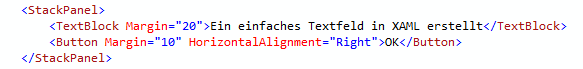

---

<!-- .slide: class="left" -->
### WPF-Features

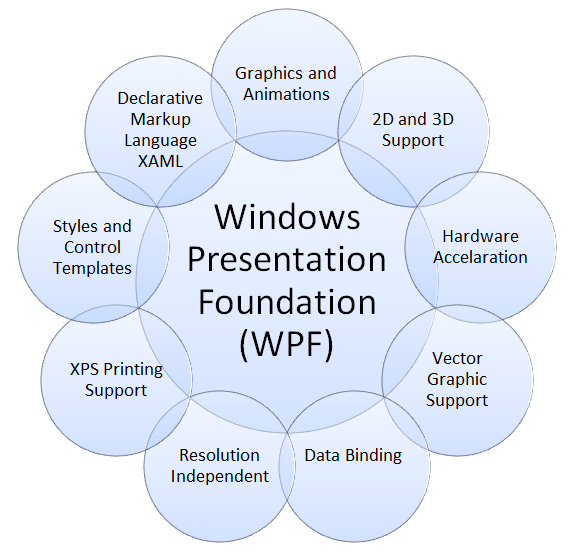

Note:

* zeitbasierte Animationen sind direkt aus WPF möglich
* Es wird Hardware benutzt anstelle der CPU (Grafikkarte, RAM)
* Vektorbasiertes Rendering (Grafiken)
* Elemente aus der GUI können autom. Elemente aus dem Code beeinflussen (oder andersrum)
* Elemente können mit dem Fenster vergrößert werden
* Es können Templates definiert werden

---

<!-- .slide: class="left" -->
### Entwurfsumgebung in Visual Studio

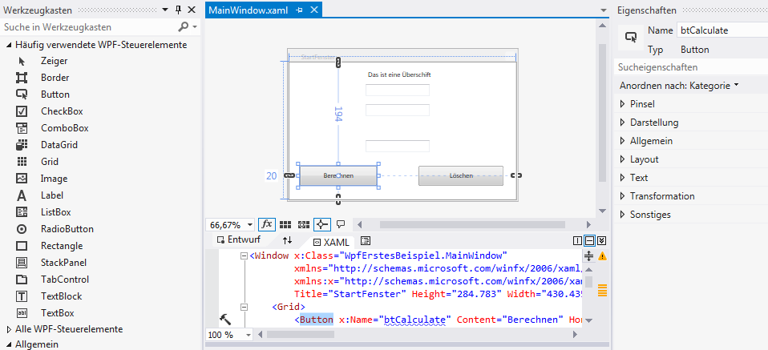

---

<!-- .slide: class="left" -->
### Bestandteile eines neuen Projekt

Das neue Projekt besteht aus vier Dateien:

* **MainWindow.xaml:** In dieser Datei steckt der XAML-Code des ersten Fensters (dort wird das Fenster beschrieben).

* **MainWindow.xaml.cs:** Darin wird der Programmcode geschrieben. Diese Datei wird auch als Code-Behind-Datei bezeichnet.

* **App.xaml:** Wird meist dazu genutzt, um Ressourcen für die gesamte Anwendung bereit zu stellen.

* **App.xaml.cs:** Code-Behind-Datei zur App.xaml

---

<!-- .slide: class="left" -->
### Steuerelemente

* Steuerelemente können in XAML definiert oder später zur Laufzeit erstellt werden.

* Jedes Steuerelemente ist eine Klasse und hat Eigenschaften und Methoden.

* Um ein Steuerelement anzusprechen, muss der Instanz (dem Steuerelement) ein Name gegeben werden.

* Bei der Namensgebung sollten immer 2-3 Buchstaben des Steuerelementtyp als Präfix dem Namen vorangestellt werden (z.B. lblUeberschrift, btnDownload).

[Übersicht Steuerelemente](https://docs.microsoft.com/de-de/dotnet/framework/wpf/controls/control-library) und 
[Steuerelemente allgemein](https://docs.microsoft.com/de-de/dotnet/framework/wpf/controls/)

---

<!-- .slide: class="left" -->
### MessageBox

* Die [MessageBox](https://learn.microsoft.com/de-de/dotnet/api/system.windows.messagebox) zeigt ein vordefiniertes Nachrichtenfenster an.

* Das Nachrichtenfenster ist modal, d.h. es kann kein anderes Fenster aktiviert werden, solang bis das Nachrichtenfenster geschlossen wurde.

```csharp
MessageBox.Show("Bitte nur Zahlen eingeben", "Fehler", 
  MessageBoxButton.OK, MessageBoxImage.Information);
```

Mit Auswertung des gedrückten Buttons:

```csharp
var message = "Möchten Sie die Daten speichern?";
var result = MessageBox.Show(message, "Datei", MessageBoxButton.OKCancel);

if (result == MessageBoxResult.OK)
{
  // TODO
}
```

Note: 
* In **VS** zeigen und alle mit machen:
  * neues WPF-Projekt erstellen
  * Dateien (App.xaml, MainWindows.xaml, Code-Behind, Projektdatei)
  * Fensterbereiche (Toolbox, UI-Designer, Eigenschaften der Controls)
  * Im neuen Projekt `Button` welcher `Messagebox` anzeigt und Anwendung beendet `Close(),` 
    * Name Control
    * Event Button
    * Text Content Caption
    * Icon für die Anwendung hinterlegen. Projekteigenschaften --> Icon
* **ÜBUNG** Umrechnung

---

<!-- .slide: class="left" -->
## Layout-Steuerelemente

In WPF gibt es mehrere Layout-Steuerelemente (Panels), die für die Anordnung von UI-Elementen verwendet werden. Jedes Layout-Element hat seine spezifische Funktion.

| **Layout**       | **Anwendungsfall**  | **Besonderheiten** |
|------------------|---------------------|--------------------|
| **Canvas** | Absolute Positionierung mit Koordinaten (x und y) | Ideal für Spiele oder frei angeordnete Elemente |
| **DockPanel** | Ausrichtung an Rändern | Menüs, Toolbars, etc. |
| **Grid** | Komplexe Layouts  | Flexibel und dynamisch|
| **UniformGrid**   | Gleichmäßige Verteilung | Für gleichförmige Layouts z.B. Schachbretter |
| **StackPanel** | Lineare Anordnung (vertikal/horizontal)  | Einfach und schnell |
| **WrapPanel** | Dynamische Anordnung (vertikal/horizontal) | Elemente brechen um |

---

<!-- .slide: class="left" -->
### Canvas

Ein `Canvas` erlaubt die absolute Positionierung von Elementen basierend auf Koordinaten.

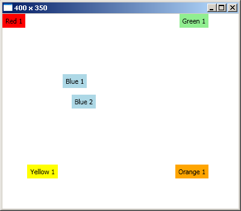

---

<!-- .slide: class="left" -->
### Beispiel Canvas

```xml
<Canvas>
  <!-- Standard Koordinaten 0,0 (von oben links) -->
  <Label Background="Red">Red 1</Label>
  <Label Canvas.Right="50" Background="LightGreen">Green 1</Label>
  <Label Canvas.Top="100" Canvas.Left="100" Background="LightBlue">Blue 1</Label>
  <Label Canvas.Bottom="166" Canvas.Right="237" Background="LightBlue">Blue 2</Label>
  <Label Canvas.Right="300" Canvas.Top="250" Background="Yellow">Yellow 1</Label>
  <Label Canvas.Right="50" Canvas.Bottom="50" Background="Orange">Orange 1</Label>
</Canvas>
```

---

<!-- .slide: class="left" -->
### DockPanel

Ein `DockPanel` richtet seine Kinder an den Rändern (oben, unten, links, rechts) aus. Es wird der gesamte Platz, welcher das `DockPanel` erhalten hat genutzt.

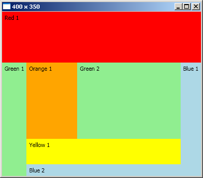

---

<!-- .slide: class="left" -->
### Beispiel DockPanel

```xml
<DockPanel>
  <Label DockPanel.Dock="Top" Height="100" Background="Red">Red 1</Label>
  <Label DockPanel.Dock="Left" Background="LightGreen">Green 1</Label>
  <Label DockPanel.Dock="Right" Background="LightBlue">Blue 1</Label>
  <Label DockPanel.Dock="Bottom" Background="LightBlue">Blue 2</Label>
  <Label DockPanel.Dock="Bottom" Height="50" Background="Yellow">Yellow 1</Label>
  <Label Width="100" Background="Orange">Orange 1</Label>   
  <!-- Standard ist "Fill" -->
  <Label Background="LightGreen">Green 2</Label>
</DockPanel>
```

---

<!-- .slide: class="left" -->
### Grid

Ein `Grid` teilt den verfügbaren Platz in Zeilen und Spalten auf.

* arbeitet mit statisch definierten Spalten und Zeilen.
* jede Zelle kann eine spezifische Höhe und Breite erhalten.
* Elemente können sich über mehrere Zellen (Zeilen oder Spalten) hinweg erstrecken (`Span`).

Grid Beispiel 1            |  Grid Beispiel (mit Span) 2
:-------------------------:|:-------------------------:
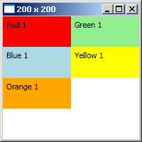  |  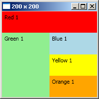

---

<!-- .slide: class="left" -->
### Beispiel Grid

```xml
<!-- Erster Screenshot -->
<Grid>
  <!-- Standard Spalten und Zeilen Kofiguration -->
  <Grid.ColumnDefinitions>
    <ColumnDefinition />
    <ColumnDefinition />
  </Grid.ColumnDefinitions>
  <Grid.RowDefinitions>
    <RowDefinition />
    <RowDefinition />
    <RowDefinition />
    <RowDefinition />
  </Grid.RowDefinitions>

  <Label Grid.Column="0" Grid.Row="0" Background="Red">Red 1</Label>
  <Label Grid.Column="1" Grid.Row="0" Background="LightGreen">Green 1</Label>
  <Label Grid.Column="0" Grid.Row="1" Background="LightBlue">Blue 1</Label>
  <Label Grid.Column="1" Grid.Row="1" Background="Yellow">Yellow 1</Label>
  <Label Grid.Column="0" Grid.Row="2" Background="Orange">Orange 1</Label>
</Grid>
```

```xml
<!-- Zweiter Screenshot nutzt ColumnSpan und RowSpan -->
<Label Grid.Column="0" Grid.Row="0" Grid.ColumnSpan="2" Background="Red">Red 1</Label>
<Label Grid.Column="0" Grid.Row="1" Grid.RowSpan="3" Background="LightGreen">Green 1</Label>
```

Note: 
* In **VS** zeigen Grid mit Spalten, Zeilen und Span anlegen mit dem Designer.

---

<!-- .slide: class="left" -->
### UniformGrid

Ein `UniformGrid` teilt den verfügbaren Platz gleichmäßig auf, sodass alle Kinder die gleiche Größe haben.

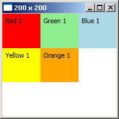

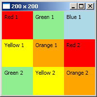

---

<!-- .slide: class="left" -->
### Beispiel UniformGrid

```xml
<UniformGrid>
  <Label Background="Red">Red 1</Label>
  <Label Background="LightGreen">Green 1</Label>
  <Label Background="LightBlue">Blue 1</Label>
  <Label Background="Yellow">Yellow 1</Label>
  <Label Background="Orange">Orange 1</Label>
  <Label Background="Red">Red 2</Label>
  <Label Background="LightGreen">Green 2</Label>
  <Label Background="Yellow">Yellow 2</Label>
  <Label Background="Orange">Orange 2</Label>
</UniformGrid>
```

---

<!-- .slide: class="left" -->
### StackPanel

Ein `StackPanel` ordnet seine Kinder in einer einzigen Richtung (vertikal oder horizontal) an. Verschachtelungen sind möglich.

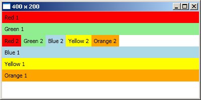

---

<!-- .slide: class="left" -->
### Beispiel StackPanel

```xml
<!-- Vertikal ist der Standard -->
<StackPanel Orientation="Vertical">
  <Label Background="Red">Red 1</Label>
  <Label Background="LightGreen">Green 1</Label>
  <!-- Verschachtelung -->
  <StackPanel Orientation="Horizontal">
    <Label Background="Red">Red 2</Label>
    <Label Background="LightGreen">Green 2</Label>
    <Label Background="LightBlue">Blue 2</Label>
    <Label Background="Yellow">Yellow 2</Label>
    <Label Background="Orange">Orange 2</Label>
  </StackPanel>
  <Label Background="LightBlue">Blue 1</Label>
  <Label Background="Yellow">Yellow 1</Label>
  <Label Background="Orange">Orange 1</Label>
</StackPanel>
```

---

<!-- .slide: class="left" -->
### WrapPanel

Ein `WrapPanel` platziert Kinder vertikal oder horizontal, wenn der verfügbare Platz nicht ausreicht wird umgebrochen.

Untergeordnete Steuerelemente werden der Reihenfolge nach von links nach rechts angeordnet. Wenn sich in der jeweiligen Zeile mehr Steuerelemente befinden, als der Raum zulässt, wird ein Zeilenumbruch durchgeführt.

---

<!-- .slide: class="left" -->
### Beispiel WrapPanel

WrapPanel horizontal            |  WrapPanel vertikal
:-------------------------:|:-------------------------:
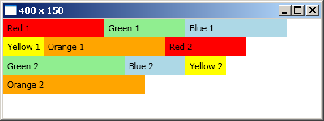  |  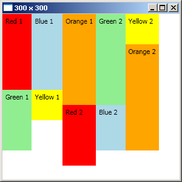

---

<!-- .slide: class="left" -->
### Beispiel WrapPanel

```xml
<!-- Horizontal ist der Standard -->
<WrapPanel> 
  <Label Width="125" Background="Red">Red 1</Label>
  <Label Width="100" Background="LightGreen">Green 1</Label>
  <Label Width="125" Background="LightBlue">Blue 1</Label>
  <Label Width="50" Background="Yellow">Yellow 1</Label>
  <Label Width="150" Background="Orange">Orange 1</Label>
  <Label Width="100" Background="Red">Red 2</Label>
  <Label Width="150" Background="LightGreen">Green 2</Label>
  <Label Width="75" Background="LightBlue">Blue 2</Label>
  <Label Width="50" Background="Yellow">Yellow 2</Label>
  <Label Width="175" Background="Orange">Orange 2</Label>
</WrapPanel>
```
```xml
<WrapPanel Orientation="Vertical">
  <Label Height="125" Background="Red">Red 1</Label>
  <Label Height="100" Background="LightGreen">Green 1</Label>
  <Label Height="125" Background="LightBlue">Blue 1</Label>
  <Label Height="50" Background="Yellow">Yellow 1</Label>
  <Label Height="150" Background="Orange">Orange 1</Label>
  <Label Height="100" Background="Red">Red 2</Label>
  <Label Height="150" Background="LightGreen">Green 2</Label>
  <Label Height="75" Background="LightBlue">Blue 2</Label>
  <Label Height="50" Background="Yellow">Yellow 2</Label>
  <Label Height="175" Background="Orange">Orange 2</Label>
</WrapPanel>
```

Note: 
* Element automatisch anpassen an Grid-Zelle: horizontaler und vertikaler Stretch, Breite + Höhe auf "auto" und Margins entfernen.
* **ÜBUNG** Taschenrechner

---

<!-- .slide: class="left" -->
## Toolbar

Die `ToolBar` ist eine einzelne Werkzeugleiste, die Schaltflächen, Menüs oder andere Steuerelemente enthalten kann. Sie wird in der Regel als Kind eines `ToolBarTray` verwendet, kann aber auch alleinstehend genutzt werden.

**Eigenschaften**:

* Enthält einzelne Steuerelemente wie Buttons, ToggleButtons, ComboBoxes, etc.
* Unterstützt Drag-and-Drop, um die ToolBar innerhalb eines `ToolBarTray` zu verschieben.
* Fügt zusätzliche Stile und Layoutfunktionen für ihre Inhalte hinzu (z. B. angepasste Größen und Spacing).

---

<!-- .slide: class="left" -->
## ToolBarTray

Der `ToolBarTray` ist ein Container für mehrere `ToolBar`-Instanzen. Er ermöglicht es, mehrere Werkzeugleisten horizontal oder vertikal zu arrangieren. Außerdem können Toolbars innerhalb des Trays verschoben oder ausgerichtet werden.

**Eigenschaften**:

* Kann mehrere `ToolBar`-Elemente enthalten.
* Unterstützt das Anordnen der Werkzeugleisten in verschiedenen Zeilen/Spalten.
* Ermöglicht Benutzern das Neupositionieren der Toolbars (wenn Drag-and-Drop aktiviert ist).

**Eigenschaften von ToolBar**:

* **Band**: Gibt an, in welcher "Zeile" die Toolbar platziert wird.
* **BandIndex**: Gibt die Position innerhalb der Zeile an.

---

<!-- .slide: class="left" -->
## Beispiel ToolBarTray und ToolBar

```xml
<ToolBarTray>
    <ToolBar Band="0" BandIndex="0">
        <Button Content="Schneiden" />
        <Button Content="Kopieren" />
        <Button Content="Einfügen" />
    </ToolBar>
    <ToolBar Band="1" BandIndex="0">
        <Button Content="Suchen" />
        <Button Content="Ersetzen" />
        <Button x:Name="btnSave">
          <Image Source="save.png" Height="20" Width="20" />
      </Button>
    </ToolBar>
</ToolBarTray>
```

---

<!-- .slide: class="left" -->
## ToolBarPanel

Das `ToolBarPanel` ist der Standard-Layout-Container, den eine `ToolBarTray` intern verwendet. Es ist für die Anordnung von Toolbars zuständig. Normalerweise arbeitet man nicht direkt mit einem `ToolBarPanel`, da es automatisch von der `ToolBarTray` verwaltet wird.

**Eigenschaften**:

* Verwaltet das Layout der Toolbars in einem `ToolBarTray`.
* Arbeitet mit `Band` und `BandIndex`, um die Positionen von Toolbars zu steuern.
* Wird selten direkt in XAML oder Code verwendet.

Note:
* In **VS** zeigen:
  * anhand des Beispiel "12_Menu_Toolbar"
  * Menü mit MenüItems geschachtelt
    * Height = 25, 
    * Add Items = "MenuItems", geschachtelt weiteres "MenuItem"

---

<!-- .slide: class="left" -->
## Ereignisse

Sie ermöglichen es, auf Benutzerinteraktionen wie Mausklicks, Tastatureingaben oder Änderungen von Steuerelementen zu reagieren.

**Wichtige Begriffe:**

**Ereignisauslöser (Event Trigger):** Ein Ereignis, das z. B. durch einen Klick ausgelöst wird.

**Ereignishandler:** Eine Methode, die ausgeführt wird, wenn das Ereignis ausgelöst wird.

---

<!-- .slide: class="left" -->
### Beispiel

```xml
<!-- Click ist der Ereignisauslöser -->
<Button x:Name="btnClear" Content="Löschen" Click="btnClear_Click"/>
```
```csharp
// Code behind, Ereignishandler
private void btnClear_Click(object sender, RoutedEventArgs e)
{
  (sender as Button).IsEnabled = false;
}
```

1. **Parameter (`object`):** Das Objekt, das das Event ausgelöst hat. Dadurch ist ein Cast auf das Steuerlement möglich.

2. **Parameter (z.B. `RoutedEventArgs`):** Zusätzliche Informationen über das Event (z. B. Details zum Klick). Je nach Ereignis unterschiedlicher Datentyp und ereignisspezifische Daten.

---

<!-- .slide: class="left" -->
## Ereignisse im Code definieren

Die Verknüpfung zwischen Ereignis und einem Ereignishandler kann auch im Code erfolgen.

```csharp
public partial class MainWindow : Window
{
  public MainWindow()
  {
    // Lädt die in der XAML-Datei (MainWindow.xaml) definierten UI-Elemente.
    InitializeComponent();
    // Registrieren des Ereignishandler für das Click-Ereignis des Buttons.
    btnInfo.Click += new RoutedEventHandler(btnInfo_Click);
  }

  // Ereignishandler
  void btnInfo_Click(object sender, RoutedEventArgs e)
  {
    MessageBox.Show("Ich bin ein Eventhandler");
  }
}
```

Note: 
* Der Operator `+= ` wird verwendet, um einen Event-Handler an ein Event anzuhängen. Es bedeutet: "Registriere diese Methode (`btnInfo_Click`) als Reaktion, wenn das Event Click ausgelöst wird."
  * Mehrere Event-Handler können an dasselbe Event gehängt werden. 
  * Das Gegenteil wäre `-=`, um einen Event-Handler wieder vom Event zu entfernen.
* `new RoutedEventHandler(btnInfo_Click)`:
Dabei wird eine neue Instanz des Delegates `RoutedEventHandler` erstellt. Dieser Delegate beschreibt eine Methode, die mit einem Event des Typs `RoutedEventArgs` arbeitet.
* Name des Ereignishandler sollte Name des Controls und des Events beinhalten.
* In **VS** zeigen, Event von Hand registrieren.

---

<!-- .slide: class="left" -->
## DispatcherTimer-Klasse

Der [`DispatcherTimer`](https://learn.microsoft.com/de-de/dotnet/api/system.windows.threading.dispatchertimer) kann Aktionen wiederholend in einem bestimmten Intervall ausführen.

```csharp
public DispatcherTimerSample()
{
  // neue Instanz erzeugen
  var timer = new DispatcherTimer();
  // In welchem Intervall soll er laufen
  timer.Interval = TimeSpan.FromSeconds(1);
  // Event mit dem Eventhandler verknüpfen
  timer.Tick += timer_Tick;
  // Läuft erst wenn die Start() ausgeführt wurde. Zum beenden Stop() ausführen
  timer.Start();
}

// Eventhandler, wird bei jedem Tick-Event ausgelöst
void timer_Tick(object sender, EventArgs e)
{
  // Aktuelle Uhrzeit jede Sekunde einem Label zuweisen
  lblTime.Content = DateTime.Now.ToLongTimeString();
}
```

```xml
<Grid>
  <Label Name="lblTime" HorizontalAlignment="Center" VerticalAlignment="Center" />
</Grid>
```

Note: 
* **ÜBUNG** Bildbetrachter

---

<!-- .slide: class="left" -->
## Data Binding

Das [Data Binding](https://docs.microsoft.com/de-de/dotnet/framework/wpf/data/data-binding-wpf) ermöglicht die Verknüpfung von Datenquellen (z.B. Objekte, Listen oder Datenbanken) mit UI-Elementen (z.B. `TextBox`, `ListView`, ...). 

Es bietet eine flexible Möglichkeit, Daten dynamisch anzuzeigen und zu aktualisieren, ohne dass eine manuelle Synchronisation zwischen UI und Datenmodell erforderlich ist.

Note: 
* Warum Datenbindung:
  * Automatische Synchronisation von UI zu Datenmodell
  * Trennung von Logik und Darstellung

---

<!-- .slide: class="left" -->
### Wie funktioniert Data Binding in WPF?

1. Datenquelle (Data Source)
   * Kann jedes beliebige .NET-Objekt sein (z.B. eine Eigenschaft, eine Liste, ein Objekt).
   * Beispiele:
     * Einzelnes Objekt: Bindung an eine Eigenschaft eines Objekts.
     * Sammlung: Bindung an Listen oder `ObservableCollection`.
     * Datenbank: Bindung an Datenbankdaten über LINQ oder EF.

2. Binding-Objekt
     * Beschreibt die Verknüpfung zwischen der Datenquelle und dem UI-Element.
     * Definiert:
       * Quelle (Source): Das Datenobjekt.
       * Pfad (Path): Welche Eigenschaft der Quelle gebunden wird.
       * Modus (Mode): Gibt an, ob die Bindung unidirektional, bidirektional oder nur einmalig ist.
  
3. Ziel (Target)
   * Ein UI-Element (z. B. `TextBox`, `Label`, `ListBox`), dessen Eigenschaft gebunden wird (z. B. `Text`, `Content`, `ItemsSource`).

Note:
* Bindungen werden zwischen zwei Elementen definiert. (Datenquelle - Datenziel).
* Im Datenziel wird eine Eigenschaft an eine Datenquelle gebunden.
* Dabei kann die Datenquelle:
    * Die Eigenschaft eines anderen Elements (z. B. eines Steuerelement) sein (Element-Bindung).
    * oder eine Datenbindung sein (C\# Objekt, Auflistung, Datenbank, XML Datei, \...)
* `ObservableCollection<T>`: Änderungen an der Sammlung sollen automatisch in der UI reflektiert werden. (UI wird bei Änderungen an der Collection aktualisiert)

---

<!-- .slide: class="left" -->
### Binding-Klasse Eigenschaften

Beschreibt die Bindung von Datenquelle zur gebundenen Komponente.

* **ElementName:** Gibt den Namen des Steuerelements (der UI) an, welches als Datenquelle dient.

* **Path:** Path ist die Eigenschaft (`Value`, `Text`, `Content`, ...) an welche die Daten gebunden werden (Standard, Angabe optional).

* **Mode:** Definiert den Bindungsmodus zwischen UI und Datenobjekt. Dieser kann einseitig (`OneWay`) oder beidseitig (`TwoWay`) sein.

* **Source:** Legt das Objekt fest, welches als Quelle der Datenbindung dient.

* **UpdateSourceTrigger:** Definiert, wann die Datenquelle aktualisiert werden soll:
  * `LostFocus`: Dann wenn das Feld den Fokus verloren hat.
  * `PropertyChanged`: Jedesmal wenn sich die die Daten ändern.

Note:
* `OneWay`: Daten fließen nur von der Quelle (Source) zum Ziel (UI-Element).
* `TwoWay`: Daten fließen in beide Richtungen
* `OneTime`: Daten werden nur einmalig von der Quelle ins Ziel geladen.
* `OneWayToSource`: Daten fließen nur vom Ziel (UI) zur Quelle (Daten).
* `Default`: Default ist ja nach Eigenschaft unterschiedlich.
* `UpdateSourceTrigger`: Bestimmt, wann die Datenquelle aktualisiert wird (PropertyChanged, LostFocus, Default).

---

<!-- .slide: class="left" -->
### Warum wird `INotifyPropertyChanged` benötigt?

Wenn eine Eigenschaft eines Objekts geändert wird, muss die Benutzeroberfläche (z.B. eine `TextBox` oder `Label`) darüber informiert werden, dass sich die zugrunde liegenden Daten geändert haben. Ohne `INotifyPropertyChanged` würde die UI nicht automatisch aktualisiert, da das Binding sonst keinen Mechanismus hat, um Änderungen mitzubekommen.


Das Interface definiert ein Ereignis namens `PropertyChanged`, das ausgelöst wird, wenn sich der Wert einer Eigenschaft ändert. UI-Elemente, die an diese Eigenschaft gebunden sind, "lauschen" auf dieses Ereignis. Sobald das Ereignis ausgelöst wird, aktualisiert die WPF-Bindungs-Engine automatisch die betroffenen UI-Elemente.

Note:
* Ohne `INotifyPropertyChanged`: Änderungen im UI werden ins Modell übernommen, aber Änderungen im Modell werden nicht automatisch im UI angezeigt.
* Mit `INotifyPropertyChanged`: Änderungen im Modell werden zusätzlich automatisch im UI reflektiert.
* Für TwoWay-Binding braucht man `INotifyPropertyChanged` nur dann, wenn man möchte, dass sich Änderungen im Modell auch direkt im UI widerspiegeln.

---

<!-- .slide: class="left" -->
### Beispiel: Ein Objekt binden

```csharp
public class Medien : INotifyPropertyChanged
{
  private string titel;

  public string Titel
  {
    get { return titel; }
    set
    {
      // Sicher stellen das sich der Wert geändert hat
      if (titel != value)
      {
        titel = value;
        // Das Ereignis auslösen, um die UI zu informieren
        OnPropertyChanged(nameof(titel));
      }
    }
  }

  public event PropertyChangedEventHandler PropertyChanged;

  protected void OnPropertyChanged(string propertyName)
  {
    PropertyChanged?.Invoke(this, new PropertyChangedEventArgs(propertyName));
  }
}
```

---

<!-- .slide: class="left" -->
### Beispiel: Ein Objekt binden

```csharp
var medien = new Medien("test", 12345);
// Datenquelle festlegen
DataContext = medien;
```

```xml
<TextBox Text="{Binding Titel}"/>
```

In diesem Fall ist keine explizite Angabe von `Path`, `ElementName` oder ähnliches notwendig.

Note: 
* Path ist optional
* **VS** zeigen: 
  * Projekt mit Textbox, Button und Elementdatenbindung. 
  * `Button.Content` an Textbox binden.
  * Eigenschaft wird nicht aktualisiert --> `INotifyPropertyChanged` nutzen.
  * Beispiel "13
  * Unterschied zu `ObservableCollection` zeigen mit "14_ObservableCollection"
* DataContext Binding auf Eigenschaft; 
* **ÜBUNG** Formular
* **ÜBUNG** Buecherfilter