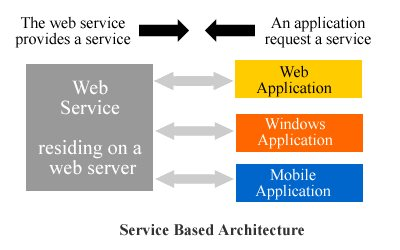

# API

Über API zu REST Webservices

---

<!-- .slide: class="left" -->
## Was ist eine API

API (Application Programming Interface)

* Schnittstelle zur Anwendungsprogrammierung.

* Kommunikationen und Datenaustausch zwischen Programmen.

* Eine Anwendung stellt eine API bereit um dritt Programmen zu ermöglicht darauf zuzugreifen.

    * Schnittstelle für andere Programme und Entwickler.

    * Ein Programm kann die Funktionen (Businesslogik) eines anderen Programms nutzen bzw. einbinden.

* Dies kann ein Webservice, ein SDK (Software Development Kit) oder eine Kernel API sein.

---

<!-- .slide: class="left" -->
## Was ist ein Webservice

Ein Webservice (Web-API) ermöglicht eine reine Computer-zu-Computer-Kommunikation.

* Ein Webservice ist eine Art API welcher meist über http oder https funktioniert.

* Er bietet einen Dienst über ein Netzwerk an.

* Ein Webservice bietet einen automatisierten Datenaustausch und Nutzung von Funktionalitäten an.

* Der Austausch von Daten und Funktionalität erfolgt unabhängig von der Programmiersprache bzw. Hardware und kann somit in unterschiedlichen Systemen integriert werden.

Note: z.B.:

* Shopsystem welches Artikel über Webservices abruft.

* Kamera hat API um diese von dritt Programmen steuern zu lassen

---

<!-- .slide: class="left" -->
### Warum Webservices

* Webservices arbeiten mit einer servicebasierten Modellarchitektur (siehe Diagramm)

* Ist von der Anwendungslogik getrennt und beeinflusst diese nicht

* Webservices verwenden ein textbasiertes Protokoll, das alle Anwendungen verstehen können

* Sind nicht auf spezielle Protokolle angewiesen (meist HTTP)

* Können mit anderen Systemen kommunizieren ohne diese extra anpassen zu müssen (kompatibel zu machen)

* Verbessern und vereinfachen den Informationsfluss zwischen Anwendungen

Note: Jede Anwendung kann andere Programmiersprache haben oder auf anderem OS laufen

---

<!-- .slide: class="left" -->
## Servicebasierte Architektur



Note: Application kann den Service aufrufen/beenden, je nach Bedarf. Benötigt nur die URL für den Abruf. Was im Service gemacht wird ist eine Blackbox

---

<!-- .slide: class="left" -->
## verschiedene Implementierungen

Es gibt verschiedene Implementierungen eines Webservices

* SOAP (Simple Object Access Protocol)

    * Kann Nachrichten über HTTP aber auch über SMTP usw. übertragen

    * Nutzt XML

    * WCF (Windows Communication Foundation)

* REST (Representational State Transfer)

    * An HTTP angelehnt

    * Operationen wie GET, PUT, POST, DELETE

* RPC (Remote Procedure Call)

    * Entfernte Funktionsaufrufe (Interprozesskommunikation)

Note: Bsp für REST Services von Facebook, Twitter, Netflix...

---

<!-- .slide: class="left" -->
## REST Webservice abfragen

```csharp []
public BookItem GetReleases(string url)
{
    using (var httpClient = new HttpClient())
    {
        try
        {
            var response = httpClient.GetStringAsync(new Uri(url)).Result;
            return JsonConvert.DeserializeObject<BookItem>(response);
        }
        catch (Exception e)
        {
            return null;
        }
    }
}
```

### Alternativ

```csharp []
public string GetReleases(string url)
{
    var client = new WebClient();
    var response = client.DownloadString(url);
    return response;
}
```

---

<!-- .slide: class="left" -->
## Daten umwandeln

REST Webservice liefern Ergebnisse als Text. Meist JSON (Java Script Object Notation) oder XML.
Um damit arbeiten zu können sollten die Daten in Objekte umgewandelt (deserialisiert) werden. Dazu wird [Json.NET](https://www.newtonsoft.com/json) verwendet. [Dokumentation Json.NET](https://www.newtonsoft.com/json/help/html/Introduction.htm), [Json to C#](http://json2csharp.com/)

```csharp []
// Klasse Account kann über Tools automatisch aus dem Json generiert werden
public class Account
{
    public string Email { get; set; }
    public bool Active { get; set; }
    public DateTime CreatedDate { get; set; }
    public IList<string> Roles { get; set; }
}

// Json String, z.B. Abfrage Ergebnis eines Webservice
string json = @"{
  'Email': 'james@example.com',
  'Active': true,
  'CreatedDate': '2013-01-20T00:00:00Z',
  'Roles': [
    'User',
    'Admin'
  ]
}";

// Json string wird in ein Objekt der Klasse Account umgewandelt
Account account = JsonConvert.DeserializeObject<Account>(json);
```

Note:
 **VS** zeigen in Console mit HttpClient Rezept API abrufen. Gibt JSON zurück (einfaches Textformat für Datenaustausch)

 Deserialisierung: Ein Text welcher für Datenübertragung optimiert ist

 NuGet

**ÜBUNG** REST Webservice abfragen

---

<!-- .slide: class="left" -->
## REST Webservice erstellen

Ein API Projekt besteht normalerweise aus einer Sammlung an Controllern die je Controller mehrere Methoden bereitstellen.

z.B. EmployeeController: aufrufbar über `http://localhost/api/employee`

**POST** – Wird benutzt um einen neuen Mitarbeiter anzulegen

**GET** - Wird benutzt um eine Liste aller Mitarbeiter abzurufen

**PUT** - Wird benutzt um eine Mitarbeiter upzudaten

**DELETE** - Wird benutzt um einen Mitarbeiter zu löschen

---

<!-- .slide: class="left" -->
## Beispiel Controller Methode

```csharp []
private static List<string> testData = new List<string>(new String[] { "Mitarbeiter1", "Andreas", "Hans", "Eddy" });

// GET: api/Employee
[ResponseType(typeof(List<string>))]
public HttpResponseMessage Get()
{
    return Request.CreateResponse(HttpStatusCode.OK, testData);
}
```

Je nach Ergebnis liefert jede Controller Methode einen [HTTP Status Code ](https://docs.microsoft.com/de-de/dotnet/api/system.net.httpstatuscode?view=netframework-4.8), [Status Code Map](https://restlet.com/http-status-map/) zurück der anzeigt ob die Aktion erfolgreich war oder warum nicht.

Note:
**VS** zeigen neues API Projekt; Values Controller; eigenen Controller; Swagger (Swashbuckle von NuGet)

**ÜBUNG** Webservice erstellen; HTTP Response Message [Route("api/xxx/{id}")];
