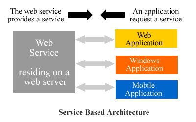

# API

Über API zu REST Webservices


<!-- .slide: class="left" -->
## Was ist eine API

API (Application Programming Interface)

* Schnittstelle zur Anwendungsprogrammierung.

* Kommunikationen und Datenaustausch zwischen Programmen.

* Eine Anwendung stellt eine API bereit um dritt Programmen zu ermöglicht darauf zuzugreifen.

    * Schnittstelle für andere Programme und Entwickler.

    * Ein Programm kann die Funktionen (Businesslogik) eines anderen Programms nutzen bzw. einbinden.

* Dies kann ein Webservice, ein SDK (Software Development Kit) oder eine Kernel API sein.


<!-- .slide: class="left" -->
## Was ist ein Webservice

Ein Webservice (Web-API) ermöglicht eine reine Computer-zu-Computer-Kommunikation.

* Ein Webservice ist eine Art API welcher meist über http oder https funktioniert.

* Er bietet einen Dienst über ein Netzwerk an.

* Ein Webservice bietet einen automatisierten Datenaustausch und Nutzung von Funktionalitäten an.

* Der Austausch von Daten und Funktionalität erfolgt unabhängig von der Programmiersprache bzw. Hardware und kann somit in unterschiedlichen Systemen integriert werden.

Note: z.B.:
* Shopsystem welches Artikel über Webservices abruft.
* Kamera hat API um diese von dritt Programmen steuern zu lassen


<!-- .slide: class="left" -->
### Warum Webservices

* Webservices arbeiten mit einer servicebasierten Modellarchitektur (siehe Diagramm)

* Ist von der Anwendungslogik getrennt und beeinflusst diese nicht

* Webservices verwenden ein textbasiertes Protokoll, das alle Anwendungen verstehen können

* Sind nicht auf spezielle Protokolle angewiesen (meist HTTP)

* Können mit anderen Systemen kommunizieren ohne diese extra anpassen zu müssen (kompatibel zu machen)

* Verbessern und vereinfachen den Informationsfluss zwischen Anwendungen

Note: Jede Anwendung kann andere Programmiersprache haben oder auf anderem OS laufen


<!-- .slide: class="left" -->
## Servicebasierte Architektur



Note: Application kann den Service aufrufen/beenden, je nach Bedarf. Benötigt nur die URL für den Abruf. Was im Service gemacht wird ist eine Blackbox


<!-- .slide: class="left" -->
## verschiedene Implementierungen

Es gibt verschiedene Implementierungen eines Webservices

* SOAP (Simple Object Access Protocol)

    * Kann Nachrichten über HTTP aber auch über SMTP usw übertragen

    * Nutzt XML

    * WCF (Windows Communication Foundation)

* REST (Representational State Transfer)

    * An HTTP angelehnt

    * Operationen wie GET, PUT, POST, DELETE

* RPC (Remote Procedure Call)

    * Entfernte Funktionsaufrufe (Interprozesskommunikation)

Note: Bsp für REST Services von Facebook, Twitter, Netflix...


<!-- .slide: class="left" -->
## REST Webservice abfragen

```csharp
using (var httpClient = new HttpClient()) {
    try {
        string response = httpClient.GetStringAsync(new Uri(url)).Result;
        return JsonConvert.DeserializeObject<BookItem>(response);
    } catch (Exception e)
    {
        return null;
    }
}
```

alternativ


```csharp
public string GetReleases(string url)
{
        var client = new WebClient();
        var response = client.DownloadString(url);
        return response;
}
```

Note: **ÜBUNG** REST Webservice abfragen (zeigen in Console mit HttpClient). Gibt JSON (Java Script Object Notation) zurück (einfaches Textformat für Datenaustausch); Swagger; Deserialisierung: Ein Text welcher für Datenübertragung optimiert ist; NuGet
**ÜBUNG** Webservice erstellen; HTTP Response Message [Route("api/xxx/{id}")]; Swashbuckle von NuGet