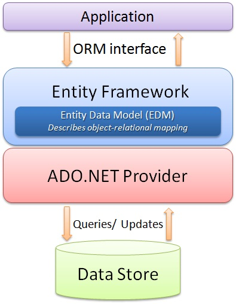

# Entity Framework

Entity Framework für Datenbankzugriffe.

---

<!-- .slide: class="left" -->
## Datenbank

Eine Datenbank ist ein elektronisches Verwaltungssystem, das besonders mit großen Datenmengen effizient, widerspruchsfrei, dauerhaft umgehen muss und logische Zusammenhänge digital abbilden kann.

Es können Datenbestände aus verschiedenen Teilmengen zusammengestellt und bedarfsgerecht für Anwendungsprogramme und deren Benutzern angezeigt werden.

---

<!-- .slide: class="left" -->
## Arten von Datenbanken

1. **Relationale Datenbanken**:

   * Daten werden in Tabellen organisiert, und die Beziehungen zwischen den Tabellen werden definiert.
   * Beispiele: MySQL, PostgreSQL, Microsoft SQL.
   * Abfragesprache: SQL (Structured Query Language) mit Dialekten.

2. **NoSQL-Datenbanken**:

   * Verwendet nicht die klassische Tabellenstruktur, sondern speichert Daten in anderen Formaten wie Dokumenten, Schlüssel-Wert-Paaren oder Graphen.
   * Beispiele: Elasticsearch, MongoDB, Cassandra.

3. **In-Memory-Datenbanken**:

   * Speichern Daten im Arbeitsspeicher statt auf der Festplatte, um eine sehr schnelle Verarbeitung zu ermöglichen.
   * Beispiel: Redis.

Note:

Einsatzbereiche:
* **Webanwendungen**: Speicherung von Benutzerdaten, Produktinformationen usw.
* **Unternehmenssoftware**: Buchhaltung, CRM, Lagerverwaltung.
* **Datenanalyse**: Speichern großer Datenmengen für Auswertungen (Data Warehousing).
* **Mobile Apps**: Lokale oder serverseitige Datenspeicherung.
---

<!-- .slide: class="left" -->
## Entity Framework

Das [Entity Framework](https://docs.microsoft.com/de-de/ef/) ist ein Framework für objektrelationale Abbildungen (ORM = Object-Relational Mapping).

Es erleichtert die Arbeit mit Datenbanken, indem es Entwicklern ermöglicht, mit Objekten und LINQ zu arbeiten, anstatt direkten SQL-Abfragen. Mit dem Entity Framework wird der Datenbankzugriff abstrahiert.

Note: 

* Entity Framework untersützt viele relationale Datenbanken (MS SQL, PostgreSQL, SQLite, MySQl, Oracle, ...)
* Klassen werden auf Tabellen, oder auch andersrum, gemappt.
* Bei Java: Hibernate; bei PHP: Doctrine; bei Python: SQLAlchemy
* Über NuGet installieren

---

<!-- .slide: class="left" -->
### Architektur




Note: 

* Intern Zugriff auf die Daten über ADO.NET (EF ist im Wesentlichen eine Abstraktionsebene über ADO.NET, die den Umgang mit Datenbanken einfacher und objektorientierter macht)
* Je nach Datenbank wird ein anderer ADO.NET Treiber genutzt.
* Zugriff mit ADO.NET ist schneller wie mit Entity Framework.

---

<!-- .slide: class="left" -->
### Vorteile
 
* **Abstraktion von SQL:** Entwickler können Datenbankoperationen oder Methodenaufrufe mit LINQ durchführen, ohne SQL nutzen zu müssen.

* **Produktivität:** Schnellere Entwicklung durch automatisiertes Mapping von Datenbanktabellen auf C#-Klassen.

* **Portabilität:** Unterstützung verschiedener Datenbanksysteme (z. B. SQL Server, MySQL, PostgreSQL).

* **Automatische Migrationen:** Unterstützung für das Erstellen und Aktualisieren von Datenbanken basierend auf dem C#-Code.

---

<!-- .slide: class="left" -->
### zwei Ansätze

Es gibt verschiedene Implementierungen eine Datenbank zu nutzen:

* **Database-First:** Mit dem DB-First-Ansatz wird die Datenbank zuerst manuell oder über ein anderes Tool erstellt. Entity Framework generiert dann die entsprechenden C#-Klassen (Modelle), die mit dieser Datenbank verknüpft sind.

* **Code-First:** Mit dem Code-First-Ansatz definieren Sie die Datenbankstruktur direkt im Code als C#-Klassen. Entity Framework erstellt die Datenbank basierend auf diesen Klassen.

---

<!-- .slide: class="left" -->
### Migrationen beim Code-First Ansatz

Migrationen ermöglichen es, Änderungen am Datenmodell (Klassen) automatisch in die Datenbank zu übertragen. Dabei ist keine manuelle Erstellung/Anpassung an der DB notwendig.

1. **Migration erstellen:** `Add-Migration <Name>` generiert eine Datei, die die Änderungen am Schema beschreibt (z. B. das Erstellen von Tabellen).

2. **Migration anwenden:** Mit `Update-Database` werden die Änderungen auf die Datenbank angewendet.

3. **Nachträgliche Änderungen:** Wenn das Datenmodell geändert wird, können neue Migrationen hinzugefügt werden um das Schema zu aktualisieren.

4. **Entfernen von Migrationen:** Beim entfernen einer Migration muss zuerst die DB auf die vorletzte Migration zurückgesetzt werden: `Update-Database <Name>`. Dann kann die letzte Migration entfernt werden `Remove-Migration`.


Note:
* Migrations in der "Package Manager Console" ausführen
* Beim entfernen von Migrations muss die DB zuvor auf die vorletzte Migration zurückgesetzt werden

---

<!-- .slide: class="left" -->
### Entity Framework verwenden

* Folgende NuGet Pakete im Projekt installieren:
  * `Microsoft.EntityFrameworkCore`
  * `Microsoft.EntityFrameworkCore.SqlServer`
  * `Microsoft.EntityFrameworkCore.Tools`
  * `Microsoft.EntityFrameworkCore.Design` (bei DB-First)

* Bei Database-First Ansatz:
  * Scaffolding ausführen um DB-Kontext-Klasse und Modelle zu erstellen.
* Bei Code-First Ansatz:
  * Modell Struktur aufbauen.
  * DB-Kontext-Klasse hinzufügen.
  * Tabelle über Migration anlegen.
    * `Add-Migration <Name>`
    * `Update-Database`
* Zugriff auf die Daten über die DB-Kontext-Klasse mit z.B. LINQ.
  
Note:
* `Scaffold-DbContext "Server=(localdb)\MSSQLLocalDB;Database=EF_Test;" Microsoft.EntityFrameworkCore.SqlServer`
* Kontext Klasse: 
  * Stellt Verbindung zur Datenbank her. Benötigt Connection String (https://www.connectionstrings.com/).
  * Weitere Konfiguration für Datenbank, Tabellen und Views möglich
* Zeigen in **VS** 42_Entity_Framework_DB_First
---

<!-- .slide: class="left" -->
#### Model aufbauen

Jede Tabelle benötigt einen Primärschlüssel. EF erkennt automatisch eine Eigenschaft namens `Id` oder `KlassennameId` als Primärschlüssel.

Standardmäßig wird der Property-Name als Spaltenname verwendet, aber man kann diesen anpassen. Außerdem kann der Datentyp explizit angegeben werden.

```csharp
// Tabellenname festlegen
[Table("UserTable")] 
public class Benutzer
{
  // Primärschlüssel
  public int BenutzerId { get; set; } 

  [Required]  // Name darf nicht leer sein
  [MaxLength(50)] // Länge auf 50 Zeichen begrenzen
  public string Name { get; set; }

  // Spalte in der Tabelle umbenennen und Datentyp definieren
  [Column("E_Mail", TypeName = "nvarchar(100)")] 
  public string Email { get; set; }
}
```

Note:
* Nullable
* Automatische Schlüssel (ID) Generierung

```csharp
[DatabaseGenerated(DatabaseGeneratedOption.Identity)]
public Guid BenutzerId { get; set; }
```

* Beziehungen zu anderen Tabellen z.B. 1:n

```csharp
public class Benutzer
{
    public int BenutzerId { get; set; }
    public string Name { get; set; }
    public List<Post> Posts { get; set; }
}

public class Post
{
    public int PostId { get; set; }
    public string Titel { get; set; }
    public int BenutzerId { get; set; }
    public Benutzer Benutzer { get; set; }
}
```

---

<!-- .slide: class="left" -->
#### DbContext-Klasse definieren

Sie stellt die Verbindung zwischen der Anwendung und der Datenbank her und definiert, wie die Datenmodelle (C#-Klassen) mit der Datenbank interagieren.

* Die `DbSet`-Eigenschaften repräsentieren die Tabellen in der Datenbank.
* In der Methode `OnConfiguring` erfolgt die Konfiguration der Verbindung zur Datenbank.
* Anpassungen am Datenmodell kann im Modell oder in der Methode `OnModelCreating` erfolgen.
* Initiale Daten für die Datenbank definieren (Daten-Seed).
 
---

<!-- .slide: class="left" -->
### Beispiel DbContext-Klasse

```csharp []
// Verwaltet die Verbindung zur Datenbank.
public class AppDbContext : DbContext
{
    public AppDbContext()
    {
    }

    // Definiert eine Datenbank-Tabelle, die das Modell (Entität) Benutzer repräsentiert.
    public DbSet<Benutzer> Benutzer { get; set; }

    // Wird beim Erstellen einer Instanz autom. aufgerufen.
    protected override void OnConfiguring(DbContextOptionsBuilder optionsBuilder)
    {
        // Datenbankverbindung konfigurieren.
        optionsBuilder.UseSqlServer(
          "Data Source = (localdb)\\mssqllocaldb; Initial Catalog = Benutzerverwaltung; Integrated Security = true;");
    }
}
```

---

<!-- .slide: class="left" -->
### Beispiel Datenbankzugriff

```csharp []
using var context = new AppDbContext();

// Daten lesen.
var list = context.Benutzer.ToList();

// Daten löschen.
context.Benutzer.Remove(list[0]);
context.SaveChanges();

// Daten updaten.
list[0].Name = "Tom Ate";
context.SaveChanges();
```

```csharp []
// Daten schreiben.
using var context = new AppDbContext();

var benutzer = new Benutzer();
benutzer.Id = Guid.NewGuid();
benutzer.Name = "Max Mustermann";

context.Benutzer.Add(benutzer);
context.SaveChanges();
```

---

<!-- .slide: class="left" -->
## lokale SQL Server DB

Im Visual Studio kann für Entwicklungszwecke eine **SQL Server Express LocalDB** genutzt werden.

* Entwicklungsdatenbanken
* Integration mit Entity Framework
* SQL-Abfragen ausführen
* Migrations-Szenarien testen

Ansicht --> "Sql Server Objekt Explorer" öffnen

Mit Rechtsklick auf **Datenbanken** kann eine neue DB erzeugt werden.

Note: 
* **SQL Server Express LocalDB:** Dabei handelt es sich um eine leichte Version des Microsoft SQL Servers, die speziell für Entwickler entwickelt wurde, um Datenbanken lokal und ohne aufwändige Installation zu verwalten.
* Über Properties Daten abrufen wie ConnectionString und Speicherort.
* Zeigen in **VS** 41_Entity_Framework_Code_First
  * neues Property hinzufügen z.B. `int Semester`
  * neue Migration erstellen und DB updaten
    * `Add-Migration <Name>`
    * `Update-Database`
  * Feld wieder entfernen, DB zurücksetzen, Migration entfernen
    * `Update-Database <Name>`
    * `Remove-Migration`
* **ÜBUNG** EntityFramework
* **ÜBUNG** Medienverwaltung SQL

---

<!-- .slide: class="left" -->
### Projekt mit lokaler DB auf anderen Computer kopieren

1. Die *.mdf und *.ldf Dateien (Datenbankdateien) ebenfalls mit kopieren.

2. Die *.mdf und *.ldf Dateien in Visual Studio dem Projekt hinzufügen.

3. Im Projekt auf die *.mdf Datei klicken. Somit öffnet sich der SQL Server Objekt Explorer.

4. Nun muss der verwendete Connection String in eurem Projekt angepasst werden.
    1. Im SQL Server Objekt Explorer rechtsklick auf eure mdf Datei und Eigenschaften wählen.
    2. Im Eigenschaften Fenster kann dann der Connection String kopiert werden.
    3. Diesen in das Projekt übernehmen.

5. Jetzt nutzt das Projekt die lokale *.mdf Datei.