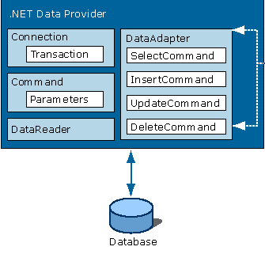
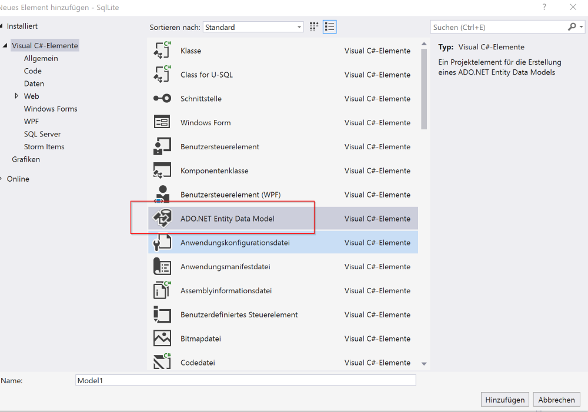
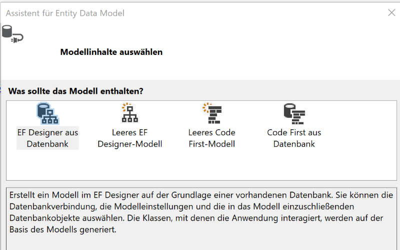
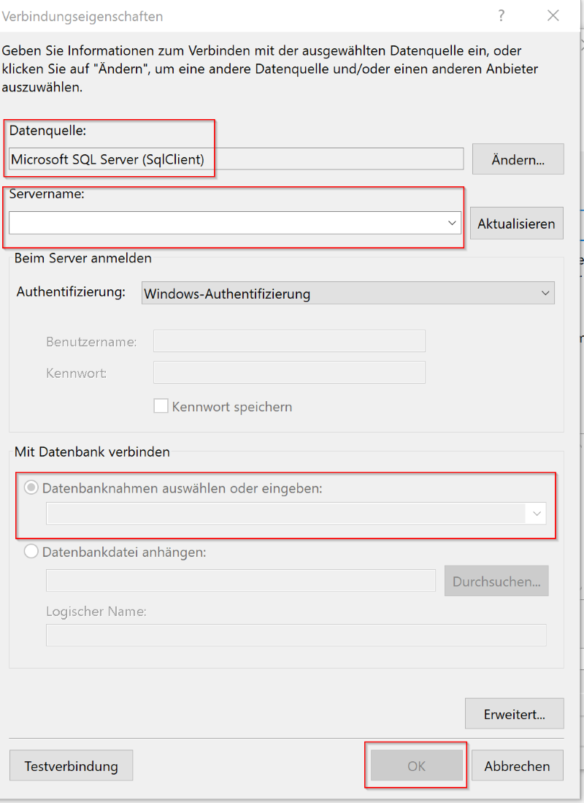

# SQL

Datenbanken mit DotNet

---

<!-- .slide: class="left" -->
## Datenbank

Eine Datenbank ist ein elektronisches Verwaltungssystem, das besonders mit großen Datenmengen effizient, widerspruchsfrei, dauerhaft umgehen muss und logische Zusammenhänge digital abbilden kann.

Es können Datenbestände aus verschiedenen Teilmengen zusammengestellt und bedarfsgerecht für Anwendungsprogramme und deren Benutzern angezeigt werden.

---

<!-- .slide: class="left" -->
## ADO.Net

Datenbankzugriffe im .NET Framework werden durch die [ADO.Net Klassen](https://docs.microsoft.com/de-de/dotnet/framework/data/adonet/ado-net-overview) abgewickelt. Durch ADO wird die nötige Basisfunktionalität geboten um auf relationale Datenbanken zuzugreifen.

Aufgabe der Klassen ist die Datenbankanbindung und Datenhaltung im Arbeitsspeicher. Dazu existieren Klassen, die Verbindung zu einer Datenbank (Microsoft SQL Server, Oracle etc.) herstellen (sogenannte Connection-Klassen), Klassen, die Tabellen im Arbeitsspeicher repräsentieren, und es ermöglichen, mit ihnen zu arbeiten (sogenannte DataTables) und Klassen, die für gesamte Datenbanken im Arbeitsspeicher stehen (sogenannte DataSets).

---

<!-- .slide: class="left" -->
### Connection Klasse

Durch die [Connection Klasse](https://docs.microsoft.com/de-de/dotnet/api/system.data.sqlclient.sqlconnection?view=netframework-4.8) wird eine Verbindung zur Datenbank repräsentiert. Sie stellt die Methoden `Open()` und `Close()` breit um eine Verbindung herzustellen oder zu schließen. Mittels einer Verbindungszeichenfolge ([ConnectionString](https://www.connectionstrings.com)) ist es möglich ein solches Objekt zu erstellen.

Um z.B. eine Verbindung mit der lokalen DB und der Datenbank "Test" aufzubauen könnte man wie folgt vorgehen:

```csharp []
var connectionString = @"Server = (localdb)\.;Initial Catalog=Test; Integrated Security = true;";
SqlConnection connection = new SqlConnection(connectionString);
```

---

<!-- .slide: class="left" -->
### Command Klasse

Die Klasse [SqlCommand](https://docs.microsoft.com/de-de/dotnet/api/system.data.sqlclient.sqlcommand?view=netframework-4.8) dient zum Ausführen von Abfragen im ADO.Net Objektmodell. Es gibt verschiedene Möglichkeiten ein Command Objekt zu
erzeugen:

```csharp []
// Methode des Connection-Objekts
SqlCommand command = connection.CreateCommand();

// parameterloser Konstruktor
SqlCommand command = new SqlCommand();
command.Connection = connection;

// In Beiden fällen folgt die Zuweisung des eigentlichen Befehls
command.CommandText = queryString;
```

```csharp
// Oder: ein parametrisierter Konstruktor
SqlCommand command = new SqlCommand(queryString, connection);
```

---

<!-- .slide: class="left" -->
### Command Klasse Methoden

* `ExecuteReader()`: Ruft Ergebnisse in einen SqlDataReader ab

* `ExecuteNonQuery()`: Erwartet keine Rückgabe (Insert, Update, Delete, Stored Procedures)

* `ExecuteScalar()`: Führt Abfrage aus, ruft erste Spalte der ersten Zeile ab (der Rest wird ignoriert).

Note: ExecuteScalar für true/false oder ID Abfragen

---

<!-- .slide: class="left" -->
### DataReader Klasse

Der [DataReader](https://docs.microsoft.com/de-de/dotnet/api/system.data.sqlclient.sqldatareader?view=netframework-4.8) ermöglicht sequentiellen Lesezugriff auf die Daten. Das Objekt wird durch den Aufruf der Methode `ExecuteReader()` des Command Objektes initialisiert. Man sollte sobald der Reader nicht mehr benötigt wird die `Close()` Methode aufrufen, um die Verbindung zu schließen. Der DataReader benötigt eine Verbindung zur Datenbank da die Daten "live" gelesen werden.

Typischerweise verwendet man einen DataReader wenn man nur lesenden Zugriff auf Datensätze benötigt.

```csharp []
SqlDataReader reader = command.ExecuteReader();
while(reader.read()) // Solange es Datensätze gibt diese lesen
{
    // Zugriff per Spaltenname oder per Index
    Console.WriteLine("ID: {0}", reader["CustomerID"]);
    Console.WriteLine("ID: {0}", reader.GetInt32(0));
}
reader.Close();
```

---

<!-- .slide: class="left" -->
### DataAdapter Klasse

Die Klasse [DataAdapter](https://docs.microsoft.com/de-de/dotnet/api/system.data.sqlclient.sqldataadapter?view=netframework-4.8) dient als Brücke zwischen den Daten in der Datenbank und einem **DataSet**, das offline verfügbar ist. Der DataAdapter befüllt das DataSet und kann die in einem DataSet zwischengespeicherten Änderungen an die Datenbank übertragen.

```csharp []
DataSet dataSet = new DataSet();
SqlDataAdapter dataAdapter = new SqlDataAdapter(query, connection);
dataAdapter.Fill(dataSet);
```

`Fill()` führt die Abfrage aus und speichert die Ergebnisse in einem DataSet.

Durch `Update()` können Änderungen an die Datenbank übermittelt werden.

---

<!-- .slide: class="left" -->
### DataSet Klasse

Das [DataSet](https://docs.microsoft.com/de-de/dotnet/api/system.data.dataset?view=netframework-4.8) speichert alle Daten die der Query liefert temporär im Speicher. D.h. man kann mit den Daten weiter arbeiten ohne Verbindung zur Datenbank. Mit dem DataSet können Daten gelesen und bearbeitet werden. [DataReader vs DataSet](https://msdn.microsoft.com/en-us/magazine/cc188717.aspx)

Im Gegensatz zu einem Command Objekt wird das Öffnen und das Schließen der Verbindung durch den DataAdapter realisiert.

Das DataSet kann genutzt werden wenn man folgendes tun möchte:

* Daten offline oder mehrfach lesen
* Daten filtern, sortieren oder darin suchen
* Daten bearbeiten
* Zeilen hinzufügen (Datensätze hinzufügen)
* Zeilen löschen (datensätze löschen)
* Daten serialisieren, also z.B. in JSON oder XML umwandeln und versenden

---

<!-- .slide: class="left" -->
### ADO.Net Architektur



---

<!-- .slide: class="left" -->
### Beispiel

```csharp []
var conn = @"Data Source=PC-DOZ-602\SQLEXPRESS; Initial Catalog=SoftwareDeveloper; User Id=user; Password=pw;";

// Daten lesen
using (SqlConnection connection = new SqlConnection(conn))
{
    connection.Open();
    string sql = "SELECT * FROM Test";
    using (SqlCommand command = new SqlCommand(sql, connection))
    {
        using (SqlDataReader reader = command.ExecuteReader())
        {
            while (reader.Read())
            {
                Console.WriteLine("GUID: {0} DE: {1} EN: {2}", reader.GetGuid(0),reader.GetString(1), reader.GetString(2));
            }
        }
    }
}

// Daten schreiben
using (SqlConnection connection = new SqlConnection(connectionString))
{
    connection.Open();
    using (SqlCommand command = new SqlCommand("INSERT INTO Test (Spalte1, Spalte2) VALUES('Entwickler', 'Developer')", connection))
    {
        // Anzahl beeinflusster Zeilen
        int rows = command.ExecuteNonQuery();
    }
}
```

Note: Zeigen in **VS** arbeiten mit SQL (lokale DB Anlegen, Connection String, Daten schreiben, Daten lesen)

**ÜBUNG** SQL Datenbanken

---

<!-- .slide: class="left" -->
## Entity Framework

Das [Entity Framework](https://docs.microsoft.com/de-de/ef/) ist ein Framework für objektrelationale Abbildungen (ORM).

Ziel ist es, die Verbindungen zu einer relationalen Datenbank so zu abstrahieren, dass der Entwickler sich auf die Datenbankeinheit als eine Menge von Objekten bzw auf Klassen und ihren Eigenschaften beziehen kann.

Note: Klassen werden auf Tabellen, oder auch andersrum, gemappt.

Bei Java Hibernate; bei PHP Doctrine.

Über NuGet installieren

---

<!-- .slide: class="left" -->
### Architektur


Note: Zugriff auf die Daten über ADO.NET. Damit ist der Zugriff auch schneller wie mit Entity Framework.

---

<!-- .slide: class="left" -->
### Vorteile

* Komfortables Arbeiten mit Objekten da alle Tabellen und Views als Klassen vorhanden sind.

* Entkopplung zwischen unserer Anwendung und der Logik des Datenzugriffs

* Erstell-, Lese-, Update-, und Löschaktionen werden vom Entity Framework realisiert

* Keine manuellen Abfragen (SQL Queries) wie mit ADO.NET notwendig

* Einfacher Wechsel von verschiedenen Datenbanktypen ohne Codeanpassung

Note: Datenzugriff wird ausgelagert (Model, Views, Controller(Logik) Entwurfsmuster MVC)

---

<!-- .slide: class="left" -->
### verschiedene Ansätze

Es gibt verschiedene Implementierungen eine Datenbank zu nutzen:

* **Database-First**: Es wird eine bereits existierende Datenbank genutzt und daraus Klassen abgeleitet. D.h. die Klassen und ihre Eigenschaften werden automatisch erzeugt.

* **Code-First**: Es wird zuerst der Code erstellt indem die Klassen und Eigenschaften definiert werden. Daraufhin wird die Datenbank mit ihren Tabellen, Feldern und Abhängigkeiten erzeugt.

---

<!-- .slide: class="left" -->
### Beispiel

```csharp []
using (SoftwareDeveloperEntities context = new SoftwareDeveloperEntities())
{
    // Daten lesen
    var list = context.Benutzer.ToList();

    // Daten löschen
    context.Medien.Remove(list[0]);
    context.SaveChanges();

    // Daten updaten
    list[0].Titel = "neuer Titel";
    context.SaveChanges();
}

// Daten schreiben
using (SoftwareDeveloperEntities context = new SoftwareDeveloperEntities())
{
    Benutzer benutzer = new Benutzer();
    // Guid erzeugen
    benutzer.Id = Guid.NewGuid();
    benutzer.Login = "at";
    benutzer.Nachname = "Ate";
    benutzer.Vorname = "Tom";
    context.Benutzer.Add(benutzer);
    context.SaveChanges();
}
```

---

<!-- .slide: class="left" -->
### Entity Framework einrichten

* Datenbank muss bestehen (SQL Server, lokale DB in Visual Studio, ...)

* Im Projekt neues Element hinzufügen



---

<!-- .slide: class="left" -->
### DB first oder Code first

* DB first oder Code first



---

<!-- .slide: class="left" -->
### Neue Verbindung

Neue Verbindung hinzufügen:

* Datenquelle z.B. SQL Server wählen
* Servername
* Authentifizierung wenn benötigt
* Datenbank auf welche zugegriffen werden soll

---

<!-- .slide: class="left" -->
### Verbindungseinstellungen



---

<!-- .slide: class="left" -->
### Entity Framework einrichten

* Nun können die gewünschten Tabellen und Ansichten gewählt werden

TODO more oder Bild

---

<!-- .slide: class="left" -->
### Daten abfragen

Um Daten abzufragen wird normalerweise LINQ verwendet (siehe C# II - LINQ)

Note: **VS** zeigen: EF hinzufügen (ADO.Net Entity Model hinzufügen) und nutzen;zeigen der Klassen und Abfragen mit LINQ.

**ÜBUNG** EntityFramework

---

<!-- .slide: class="left" -->
## lokale SQL Server DB

Im Microsoft SQL Server Express kann für Entwicklungszwecke eine [lokale SQL DB](https://docs.microsoft.com/de-de/sql/database-engine/configure-windows/sql-server-express-localdb?view=sql-server-ver15) erstellt werden.

Diese kann direkt aus Visual Studio genutzt werden:

Ansicht --> Sql Server Objekt Explorer öffnen

Mit Rechtsklick auf **Datenbanken** kann eine neue DB erzeugt werden. Bitte den Speicherort der Datei anpassen damit ihr wisst wo die Datenbank liegt!

Erneuter Rechtsklick auf Tabellen innerhalb der neuen Datenbank um eine neue **Tabelle** anzulegen.

---

<!-- .slide: class="left" -->
### Projekt auf anderem Computer kopieren

1. Die mdf und ldf Dateien (Datenbankdateien) ebenfalls mit kopieren.

2. Die mdf und ldf Datei im Visual Studio dem Projekt hinzufügen.

3. Im Projekt auf die mdf Datei klicken. Somit öffnet sich der SQL Server Objekt Explorer.

4. Nun muss noch der verwendete Connection String in eurem Projekt angepasst werden.
    1. Im SQL Server Objekt Explorer rechtsklick auf eure mdf Datei und Eigenschaften wählen.
    2. Im Eigenschaften Fenster kann dann der Connection String (Verbindungszeichenfolge) kopiert werden.
    3. Diesen in euer Projekt übernehmen.

5. Jetzt sollte euer Projekt mit der lokalen DB auch auf einem anderen Computer laufen.
