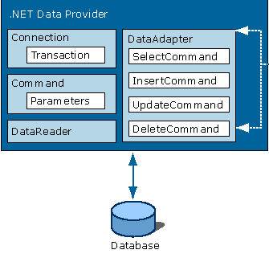
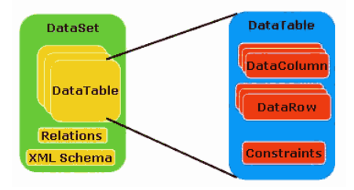
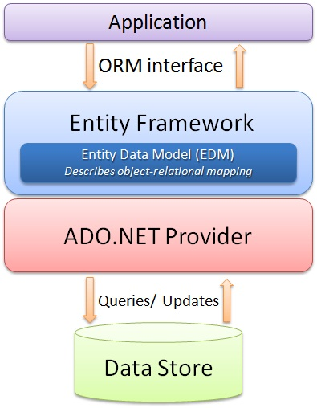

# SQL

Datenbanken mit DotNet


<!-- .slide: class="left" -->
## Datenbank

Eine Datenbank ist ein elektronisches Verwaltungssystem, das besonders mit großen Datenmengen effizient, widerspruchsfrei, dauerhaft umgehen muss und logische Zusammenhänge digital abbilden kann.

Es können Datenbestände aus verschiedenen Teilmengen zusammengestellt und bedarfsgerecht für Anwendungsprogramme und deren Benutzern angezeigt werden.


<!-- .slide: class="left" -->
## ADO.Net

Datenbankzugriffe im .NET Framework werden durch die [ADO.Net Klassen](https://docs.microsoft.com/de-de/dotnet/framework/data/adonet/ado-net-overview) abgewickelt. Durch ADO wird die nötige Basisfunktionalität geboten um auf relationale Datenbanken zuzugreifen.

Aufgabe der Klassen ist die Datenbankanbindung und Datenhaltung im Arbeitsspeicher. Dazu existieren Klassen, die Verbindung zu einer Datenbank (Microsoft SQL Server, Oracle etc.) herstellen (sogenannte Connection-Klassen), Klassen, die Tabellen im Arbeitsspeicher repräsentieren, und es ermöglichen, mit ihnen zu arbeiten (sogenannte DataTables) und Klassen, die für gesamte Datenbanken im Arbeitsspeicher stehen (sogenannte DataSets).


<!-- .slide: class="left" -->
### ADO.Net Architektur




<!-- .slide: class="left" -->
### Connection Klasse

Durch die [Connection Klasse](https://docs.microsoft.com/de-de/dotnet/api/system.data.sqlclient.sqlconnection?view=netframework-4.8) wird eine Verbindung zur Datenbank repräsentiert. Sie stellt die Methoden `Open()` und `Close()` breit um eine Verbindung herzustellen oder zu schließen. Mittels einer Verbindungszeichenfolge ([ConnectionString](https://www.connectionstrings.com)) ist es möglich ein solches Objekt zu erstellen.

Um z.B. eine Verbindung mit der lokalen DB und der Datenbank "Test" aufzubauen könnte man wie folgt vorgehen:

```csharp
string connectionString = @"Server = (localdb)\.;Initial Catalog=Test; Integrated Security = true;";
SqlConnection connection = new SqlConnection(connectionString);
```


<!-- .slide: class="left" -->
### Command Klasse

Die Klasse [SqlCommand](https://docs.microsoft.com/de-de/dotnet/api/system.data.sqlclient.sqlcommand?view=netframework-4.8) dient zum Ausführen von Abfragen im ADO.Net Objektmodell. Es gibt verschiedene Möglichkeiten ein Command Objekt zu
erzeugen:

```csharp
// Methode des Connection-Objekts
SqlCommand command = connection.CreateCommand();

// parameterloser Konstruktor
SqlCommand command = new SqlCommand();
command.Connection = connection;

// In Beiden fällen folgt die Zuweisung des eigentlichen Befehls
command.CommandText = queryString;
```

```csharp
// Oder: ein parametrisierter Konstruktor
SqlCommand command = new SqlCommand(queryString, connection);
```


<!-- .slide: class="left" -->
### Command Klasse Methoden

* `ExecuteReader()`: Ruft Ergebnisse in einen SqlDataReader ab

* `ExecuteNonQuery()`: Erwartet keine Rückgabe (Insert, Update, Delete, Stored Procedures)

* `ExecuteScalar()`: Führt Abfrage aus, ruft erste Spalte der ersten Zeile ab (der Rest wird ignoriert).

Note: ExecuteScalar für true/false oder ID Abfragen


<!-- .slide: class="left" -->
### DataReader Klasse

Der [DataReader](https://docs.microsoft.com/de-de/dotnet/api/system.data.sqlclient.sqldatareader?view=netframework-4.8) ermöglicht sequentiellen Lesezugriff auf die Daten. Das Objekt wird durch den Aufruf der Methode `ExecuteReader()` des Command Objektes initialisiert. Man sollte unbedingt sobald der Reader nicht mehr benötigt wird die `Close()` Methode aufrufen, um ungewollte Verbindungsprobleme zu vermeiden.

Typischerweise verwendet man einen DataReader wenn man nur lesenden Zugriff auf Datensätze benötigt. Eine Anwendung des DataReaders könnte wie folgt aussehen:

```csharp
SqlDataReader reader = command.ExecuteReader();
while(reader.read()) // Solange es Datensätze gibt diese lesen
{
    // Zugriff per Spaltenname oder per Index
    Console.WriteLine("ID: {0}", reader["CustomerID"]);
    Console.WriteLine("ID: {0}", reader.GetInt32(0));
}
reader.Close();
```


<!-- .slide: class="left" -->
### DataSet Klasse

Eigentlich ist das [DataSet](https://docs.microsoft.com/de-de/dotnet/api/system.data.dataset?view=netframework-4.8) Objekt eine Datenmenge, die Daten sind allerdings nicht mit der Datenbank verbunden. Im Gegensatz zum DataReader kann man beliebig auf die Daten zugreifen. Es ist möglich zu sortieren, zu suchen und zu filtern.




<!-- .slide: class="left" -->
### DataAdapter Klasse

Die Klasse [DataAdapter](https://docs.microsoft.com/de-de/dotnet/api/system.data.sqlclient.sqldataadapter?view=netframework-4.8) dient als Brücke zwischen den Daten in der Datenbank und einem DataSet, das offline verfügbar ist. Der DataAdapter kann in einem DataSet zwischengespeicherte Änderungen an die Datenbank übermitteln. Im Gegensatz zu einem Command Objekt wird das Öffnen und das Schließen der Verbindung durch den DataAdapter verwaltet.

```csharp
DataSet ds = new DataSet();
SqlDataAdapter da = new SqlDataAdapter(query, connection);
da.Fill(ds);
```

`Fill()` führt die Abfrage aus und speichert die Ergebnisse in einem DataSet. Durch die Methode `Update()` können Änderungen an die Datenbank übermittelt werden.


<!-- .slide: class="left" -->
### Beispiel

```csharp
string conn = @"Data Source=PC-DOZ-602\SQLEXPRESS; Initial Catalog=SoftwareDeveloper; User Id=user; Password=pw;";

// Daten lesen
using (SqlConnection connection = new SqlConnection(conn))
{
    connection.Open();
    string sql = "SELECT * FROM Test";
    using (SqlCommand command = new SqlCommand(sql, connection))
    {
        using (SqlDataReader reader = command.ExecuteReader())
        {
            while (reader.Read())
            {
                Console.WriteLine("GUID: {0} DE: {1} EN: {2}", reader.GetGuid(0),reader.GetString(1), reader.GetString(2));
            }
        }
    }
}

// Daten schreiben
using (SqlConnection connection = new SqlConnection(connectionString))
{
    connection.Open();
    using (SqlCommand command = new SqlCommand("INSERT INTO Test (Spalte1, Spalte2) VALUES('Entwickler', 'Developer')", connection))
    {
        // Anzahl beeinflusster Zeilen
        int rows = command.ExecuteNonQuery();
    }
}
```

Note: Zeigen in **VS** arbeiten mit SQL (lokale DB Anlegen, Connection String, Daten schreiben, Daten lesen)

**ÜBUNG** SQL Datenbanken


<!-- .slide: class="left" -->
## Entity Framework

Das [Entity Framework](https://docs.microsoft.com/de-de/ef/) ist ein Framework für objektrelationale Abbildungen (ORM).

Ziel ist es, die Verbindungen zu einer relationalen Datenbank so zu abstrahieren, dass der Entwickler sich auf die Datenbankeinheit als eine Menge von Objekten bzw auf Klassen und ihren Eigenschaften beziehen kann.

Note: Klassen werden auf Tabellen, oder auch andersrum, gemappt.

Bei Java Hibernate; bei PHP Doctrine. 

Über NuGet installieren


<!-- .slide: class="left" -->
### Architektur



Note: Zugriff auf die Daten über ADO.NET. Damit ist der Zugriff auch schneller wie mit Entity Framework.


<!-- .slide: class="left" -->
### Vorteile

* Keine manuellen Abfragen (SQL Queries) wie mit ADO.NET notwendig

* Einfacher Wechsel von verschiedenen Datenbanktypen ohne Codeanpassung

* Entkopplung zwischen unserer Anwendung und der Logik des Datenzugriffs

* Komfortables Arbeiten mit Objekten da alle Tabellen und Views als Klassen vorhanden sind.

Note: Datenzugriff wird ausgelagert (Model, Views, Controller(Logik) Entwurfsmuster MVC)


<!-- .slide: class="left" -->
### verschiedene Ansätze

Es gibt verschiedene Implementierungen eine Datenbank zu nutzen:

* **Database-First**: Es wird eine bereits existierende Datenbank genutzt und daraus Klassen abgeleitet. D.h. die Klassen und ihre Eigenschaften werden automatisch erzeugt.

* **Code-First**: Es wird zuerst der Code erstellt indem die Klassen und Eigenschaften definiert werden. Daraufhin wird die Datenbank mit ihren Tabellen, Feldern und Abhängigkeiten erzeugt.


<!-- .slide: class="left" -->
### Beispiel

Daten lesen

```csharp
using (SoftwareDeveloperEntities context = new SoftwareDeveloperEntities())
{
    var list = context.Benutzer.ToList();
}
```

Daten schreiben

```csharp
using (SoftwareDeveloperEntities context = new SoftwareDeveloperEntities())
{
    Benutzer benutzer = new Benutzer();
    benutzer.Id = Guid.NewGuid();
    benutzer.Login = "at";
    benutzer.Nachname = "Ate";
    benutzer.Vorname = "Tom";
    context.Benutzer.Add(benutzer);
    context.SaveChanges();
}
```


<!-- .slide: class="left" -->
### Daten abfragen

* LINQ-to-Entities (Language-Integrated Query bzw Sprachintegrierte Abfrage): Damit können Daten aus verschiedenen Datenquellen (einfache Liste, ein Wörterbuch, eine XML-Datei oder eine Datenbanktabelle) abgefragt und bearbeitet werden. [LINQ](https://docs.microsoft.com/de-de/dotnet/csharp/programming-guide/concepts/linq/introduction-to-linq-queries) gibt es in zwei Syntaxvarianten: Die Abfrage- und die Methodensyntax.

* Klassisch mit SQL Syntax

Note: Aussprache: Link. Verschiedene LINQ Provider z.B. LINQ-to-SQL, LINQ-to-XML, LINQ-to-DataSets, ...


<!-- .slide: class="left" -->
#### LINQ Syntaxvarianten

```csharp
var names = new List<string>()  
{  
    "John Doe",  
    "Jane Doe",  
    "Jenna Doe",  
    "Joe Doe"  
};  
```

```csharp
// Alle Namen holen welche 8 oder weniger Zeichen haben
// Abfragesyntax
var shortNames = from name in names where name.Length <= 8 orderby name.Length select name;

// Methodensyntax
var shortNames = names.Where(name => name.Length <= 8).OrderBy(name => name.Length);

// Daten abfragen und ausgeben
foreach (var name in shortNames)  
{
    Console.WriteLine(name);
}

```

Note: In nur einer Zeile kann man z.B. alle Namen abfragen welche 8 oder weniger Zeichen lang sind und der Länge nach sortieren


<!-- .slide: class="left" -->
#### LINQ Methodensyntax

Bei [Lambda Expressions](https://docs.microsoft.com/de-de/dotnet/csharp/programming-guide/statements-expressions-operators/lambda-expressions) ist auf der linken Seite der Eingabeparameter. Der Name ist frei wählbar und der Wert kommt aus der Where Bedingung. Auf der rechten Seite steht die Anweisung bzw der Ausdruck.

```csharp

name => name.Length <= 8

List<int> numbers = new List<int>()
{
    1, 7, 2, 61, 14
};
```

```csharp
List<int> sortNum = numbers.OrderBy(number => number).ToList();
```

```csharp
List<User> sortedUsers = listOfUsers.OrderBy(user => user.Age)
                                    .ThenByDescending(user => user.Name)
                                    .ToList();

```

Note: Abfrage wird erst ausgeführt wenn mit den Daten gearbeitet wird z.B. iterieren, ToList(), Count(),  D.h. es sind Abfragen über mehrere Zeilen möglich


<!-- .slide: class="left" -->
#### LINQ Beispiel

```csharp
List<User> users = new List<User>()
{
    new User() { Name = "John Doe", Age = 42 },
    new User() { Name = "Jane Doe", Age = 34 },
    new User() { Name = "Joe Doe", Age = 8 },
    new User() { Name = "Another Doe", Age = 15 },
};
// Abfragesyntax
var names = from test in users select test.Name;

// Methodensyntax
var names = users.Select(x => x.Name).ToList();
```

Note: **VS** zeigen: EF hinzufügen  (ADO.Net Entity Model hinzufügen )und nutzen; zeigen der Klassen und Abfragen mit LINQ.

**ÜBUNG** EntityFramework