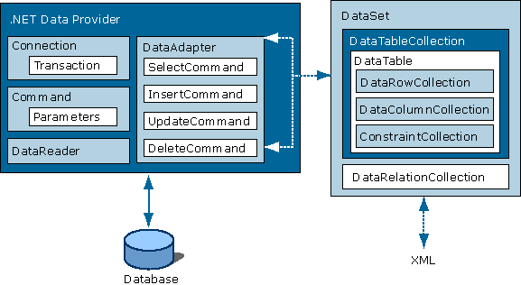

# ADO.Net

Datenbanken mit ADO.Net.

---

<!-- .slide: class="left" -->
## ADO.Net

Datenbankzugriffe im .NET Framework werden durch die [ADO.Net Klassen](https://docs.microsoft.com/de-de/dotnet/framework/data/adonet/ado-net-overview) abgewickelt. Durch ADO wird die nötige Basisfunktionalität geboten um auf relationale Datenbanken zuzugreifen.

Aufgabe der Klassen ist die Datenbankanbindung und Datenhaltung im Arbeitsspeicher. Dazu existieren Klassen, die Verbindung zu einer Datenbank (Microsoft SQL Server, Oracle etc.) herstellen (sogenannte Connection-Klassen), Klassen, die Tabellen im Arbeitsspeicher repräsentieren, und es ermöglichen, mit ihnen zu arbeiten (sogenannte DataTables) und Klassen, die für gesamte Datenbanken im Arbeitsspeicher stehen (sogenannte DataSets).

Note:
* ADO = ActiveX Data Objects

---

<!-- .slide: class="left" -->
### SqlConnection-Klasse

Durch die [`SqlConnection`](https://learn.microsoft.com/de-de/dotnet/api/system.data.sqlclient.sqlconnection) wird eine Verbindung zur Datenbank repräsentiert. Sie stellt die Methoden `Open()` und `Close()` bereit um eine Verbindung herzustellen oder zu schließen. Mittels einer Verbindungszeichenfolge ([ConnectionString](https://www.connectionstrings.com)) ist es möglich ein solches Objekt zu erstellen.

Um z.B. eine Verbindung mit der lokalen DB und der Datenbank "Test" aufzubauen könnte man wie folgt vorgehen:

```csharp
var connectionString = @"Server = (localdb)\.;Initial Catalog=Test; Integrated Security = true;";
SqlConnection connection = new SqlConnection(connectionString);
```

---

<!-- .slide: class="left" -->
### SqlCommand-Klasse

Die Klasse [`SqlCommand`](https://docs.microsoft.com/de-de/dotnet/api/system.data.sqlclient.sqlcommand) dient zum Ausführen von Abfragen im ADO.Net Objektmodell. Es gibt verschiedene Möglichkeiten ein `SqlCommand`-Objekt zu erzeugen:

```csharp
// Methode des SqlConnection-Objekts
SqlCommand command = connection.CreateCommand();

// parameterloser Konstruktor
SqlCommand command = new SqlCommand();
command.Connection = connection;

// In beiden Fällen folgt die Zuweisung des eigentlichen Befehls
command.CommandText = queryString;
```

```csharp
// Oder: ein parametrisierter Konstruktor
SqlCommand command = new SqlCommand(queryString, connection);
```

---

<!-- .slide: class="left" -->
### SqlCommand-Klasse Methoden

* `ExecuteReader()`: Ruft Ergebnisse in ein `SqlDataReader`-Objekt ab
.
* `ExecuteNonQuery()`: Erwartet keine Rückgabe (Insert, Update, Delete, Stored Procedures)

* `ExecuteScalar()`: Führt Abfrage aus, ruft erste Spalte der ersten Zeile ab (der Rest wird ignoriert).

Note: 
* `ExecuteScalar()` für `true`/`false` oder ID-Abfragen

---

<!-- .slide: class="left" -->
### SqlDataReader-Klasse

Der [`SqlDataReader`](https://docs.microsoft.com/de-de/dotnet/api/system.data.sqlclient.sqldatareader) ermöglicht sequentiellen Lesezugriff auf die Daten. Das Objekt wird durch den Aufruf der Methode `ExecuteReader()` des `SqlCommand`-Objektes initialisiert. Man sollte sobald der Reader nicht mehr benötigt wird die `Close()` Methode aufrufen, um die Verbindung zu schließen. 

Der `SqlDataReader` benötigt eine Verbindung zur Datenbank da die Daten "live" gelesen werden.

Typischerweise verwendet man einen `SqlDataReader` wenn man nur lesenden Zugriff auf Datensätze benötigt.

```csharp []
SqlDataReader reader = command.ExecuteReader();
while(reader.read()) // Solange es Datensätze gibt diese lesen
{
    // Zugriff per Spaltenname oder per Index
    Console.WriteLine("ID: {0}", reader["CustomerID"]);
    Console.WriteLine("ID: {0}", reader.GetInt32(0));
}
reader.Close();
```

---

<!-- .slide: class="left" -->
### SqlDataAdapter-Klasse

Die Klasse [`SqlDataAdapter`](https://docs.microsoft.com/de-de/dotnet/api/system.data.sqlclient.sqldataadapter) dient als Brücke zwischen den Daten in der Datenbank und einem `DataSet`, das offline verfügbar ist. Der `SqlDataAdapter` befüllt das `DataSet` und kann die in einem `DataSet` zwischengespeicherten Änderungen an die Datenbank übertragen.

```csharp
DataSet dataSet = new DataSet();
SqlDataAdapter dataAdapter = new SqlDataAdapter(query, connection);
dataAdapter.Fill(dataSet);
```

`Fill()` führt die Abfrage aus und speichert die Ergebnisse in einem `DataSet`.

Durch `Update()` können Änderungen an die Datenbank übermittelt werden.

---

<!-- .slide: class="left" -->
### DataSet-Klasse

Das [DataSet](https://docs.microsoft.com/de-de/dotnet/api/system.data.dataset) speichert alle Daten die der Query liefert temporär im Speicher. D.h. man kann mit den Daten weiter arbeiten ohne Verbindung zur Datenbank. Mit dem `DataSet` können Daten gelesen und bearbeitet werden. [DataReader vs DataSet](https://msdn.microsoft.com/en-us/magazine/cc188717.aspx)

Im Gegensatz zu einem `SqlCommand`-Objekt wird das Öffnen und das Schließen der Verbindung durch den `SqlDataAdapter` realisiert.

Das `DataSet` kann genutzt werden wenn man folgendes tun möchte:

* Daten offline oder mehrfach lesen
* Daten filtern, sortieren oder darin suchen
* Daten bearbeiten
* Zeilen hinzufügen (Datensätze hinzufügen)
* Zeilen löschen (datensätze löschen)
* Daten serialisieren, also z.B. in JSON oder XML umwandeln und versenden

---

<!-- .slide: class="left" -->
### ADO.Net Architektur



---

<!-- .slide: class="left" -->
### Beispiel

```csharp []
var conn = @"Data Source=PC-DOZ-602\SQLEXPRESS; Initial Catalog=SoftwareDeveloper; User Id=user; Password=pw;";

// Daten lesen
using (SqlConnection connection = new SqlConnection(conn))
{
    connection.Open();
    string sql = "SELECT * FROM Test";
    using (SqlCommand command = new SqlCommand(sql, connection))
    {
        using (SqlDataReader reader = command.ExecuteReader())
        {
            while (reader.Read())
            {
                Console.WriteLine("GUID: {0} DE: {1} EN: {2}", reader.GetGuid(0),reader.GetString(1), reader.GetString(2));
            }
        }
    }
}
```

```csharp []
// Daten schreiben
using (SqlConnection connection = new SqlConnection(connectionString))
{
    connection.Open();
    using (SqlCommand command = new SqlCommand("INSERT INTO Test (Spalte1, Spalte2) VALUES('Entwickler', 'Developer')", connection))
    {
        // Anzahl beeinflusster Zeilen
        int rows = command.ExecuteNonQuery();
    }
}
```

Note: 
* Zeigen in **VS** arbeiten mit SQL (lokale DB Anlegen, Connection String, Daten schreiben, Daten lesen)
* **ÜBUNG** SQL Datenbanken