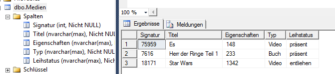

# Übung 10 - Medienveraltung

Ändern Sie die Anwendung so ab damit die Medien in einer SQL Datenbank gespeichert werden.

Es sind am gesamten Programm kleiner Anpassungen notwendig damit die Anwendung weiterhin läuft. Ansonsten soll die Grundfunktion der Anwendung gleich bleiben.

## Hinweis

Es ist nicht gewünscht die Daten als Objekte abzuspeichern. D.h. vor dem speichern das Objekt auslesen und die einzelnen Eigenschaften speichern. Beim einlesen genau dasselbe.

## Connection String

`Data Source=PC-DOZ-602\SQLEXPRESS; Initial Catalog=SoftwareDeveloper; User Id=softwaredeveloper; Password = 123test;`

## Datenbankspalten

## SQL Statements

### Hinzufügen

`INSERT INTO Medien VALUES(@Sig,@Titel,@Eigenschaft,@Typ,@Leihstatus)`

### Prüfen ob die Signatur bereits vorhanden ist

`SELECT count(1) FROM Medien WHERE Signatur = '" + key + "'"`

### Alle Medien abrufen

`SELECT * FROM Medien`

### Ein bestimmtes Element abrufen

`SELECT * FROM Medien WHERE Signatur='" + key + "'"`

### Ein Element löschen

`DELETE Medien WHERE Signatur = '" + key + "'"`

### Den Leihstatus bei einem bestimmten Element ändern

`UPDATE Medien SET Leihstatus ='" + leihstatus.ToString() + "' WHERE Signatur='" + key + "'"`
