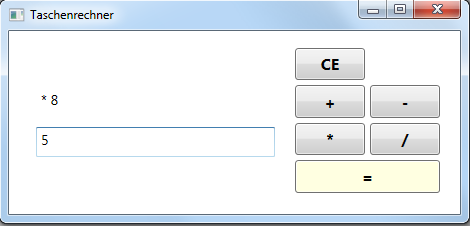

# Übung 2 - Taschenrechner

Erstellen Sie einen Taschenrechner (WPF Anwendung) der die Grundrechenarten beherrscht.

Sie können die GUI frei nach ihren Wünschen gestalten. Das Bild oben ist nur ein Beispiel wie der Taschenrechner aussehen könnte (Sie können auch 3 Textfelder benutzen um es nicht unnötig kompliziert zu machen).

**Benutzen Sie als Layout kein Canvas!**

Fehlerhafte und ungültige Eingaben sollen abgefangen und eine Meldung ausgegeben werden. Achten Sie außerdem darauf, dass ein Teilen durch 0 nicht möglich ist.

## Beispiel

