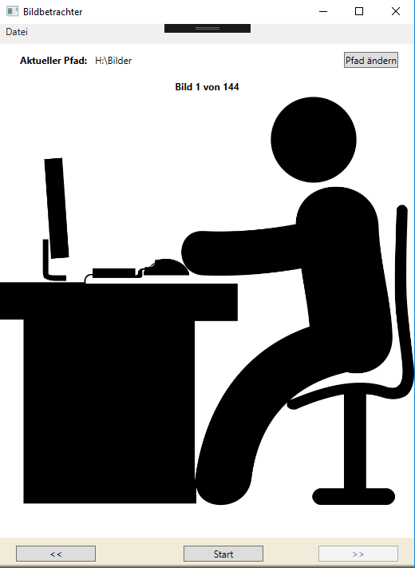

# Übung 3 - Bildbetrachter

Erstellen Sie eine WPF Anwendung um alle Bilder aus einem bestimmten Pfad anzuzeigen und durch vor und zurück das Bild zu ändern.

Achten sie darauf, dass Sie folgende Funktionalitäten einbinden:
* Der Ordner soll über einen Auswahldialog gewählt werden können
* Es sollen nur Bilder mit den Endungen *.jpg angezeigt werden
* Der Ordner soll in der laufenden Anwendung geändert werden können
* Der Ordner und das aktuelle Bild sollen angezeigt werden
* Achten Sie auf Arrayüberlaufe oder nutzen Sie ein anderes Konstrukt.
* Integrieren Sie ein Menü mit dem Menüpunkt „Datei“ welcher einen Untereintrag „beenden“ besitzt.

**Hinweis:** Einen Ordnerauswahldialog erhalten Sie mit:

```csharp
var dialog = new System.Windows.Forms.FolderBrowserDialog();
System.Windows.Forms.DialogResult result = dialog.ShowDialog();
folderPath = dialog.SelectedPath;
```

Um die >> und << als Caption für den Button zu nutzen folgende Zeichenfolge verwenden.

\&lt;\&lt; und \&gt;\&gt;

## Optional

Bauen Sie eine Diashow Funktion ein die Sie starten und beenden können. Dazu kann die Klasse `DispatcherTimer` benutzt werden.

## Beispiel


