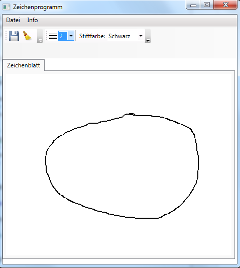

# Übung 4 - Zeichenprogramm

Erstellen Sie eine WPF Anwendung die es ermöglicht mit der Maus zu zeichnen.

Achten sie darauf, dass Sie folgende Funktionalitäten einbinden:

* Die Farbe und die Dicke der Linie veränderbar
* Die Zeichnung soll gespeichert und gelöscht werden können
* Beim Speichern soll ein Dialog erscheinen der uns den Pfad und den Dateinamen auswählen lässt. Dazu kann folgende Klasse verwendet werden:  `Microsoft.Win32.SaveFileDialog`.

## Hinweis

* Als Zeichnungshintergrund ein „Canvas“ verwenden. Setzen Sie den Hintergrund auf eine Farbe oder auf Transparent um die MouseEvents abfragen zu können!
* Speichern Sie die aktuelle Position der Maus bei einem „MouseDown“ Event.
* Mit einem „MouseMove“ Event können sie dann die Linie zeichnen, wenn z.B. eine Maustaste gedrückt wurde.
* Um den Inhalt des Canvas in ein Bild umzuwandeln nutzen Sie das folgende Konstrukt.

```csharp
RenderTargetBitmap rtb = new RenderTargetBitmap((int)cavDraw.RenderSize.Width,
        (int)cavDraw.RenderSize.Height, 96d, 96d, PixelFormats.Default);
rtb.Render(cavDraw);
BitmapEncoder pngEncoder = new PngBitmapEncoder();
pngEncoder.Frames.Add(BitmapFrame.Create(rtb));
. . .
pngEncoder.Save(fileStream);
```

## Beispiel

