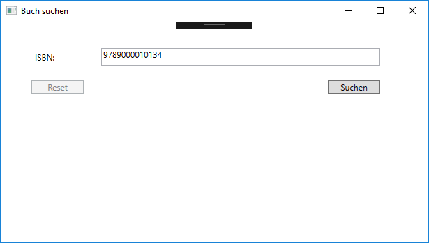
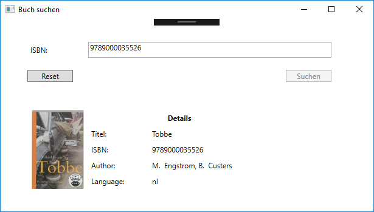

# Übung 6 - Webservice abrufen

Erstellen Sie einen WPF Anwendung welche einen REST Webservice abruft.

Dieser Webservice benötigt als Parameter eine ISBN und gibt dann zu diesem Buch Infos zurück. Weiteres bitte aus den Screenshots entnehmen.

[Beschreibung](https://www.booknomads.com/en/dev)

[Webservice Url](https://www.booknomads.com/api/v0/isbn/9789000010134)

[Test des Webservice](https://app.swaggerhub.com/apis/BookNomads/book_by_isbn/1.0.0#/default/get_isbn__ISBN_)

Beispiel ISBN's:

* 9789000035526
* 9789000010134

## Beispiel

## Hinweis

Der Webservice liefert einen JSON String zurück. Dieser muss [Deserialisiert](https://www.newtonsoft.com/json/help/html/DeserializeObject.htm) werden. D.h. wieder zurück in ein Objekt umgewandelt werden.
Dazu ist ein Objekt nötig welches die Daten aufnehmen kann.

## Erweiterung

Zuerst den klassischen Weg ohne Datenbindung benutzen. Danach umstellen auf WPF mit Datenbindung.
