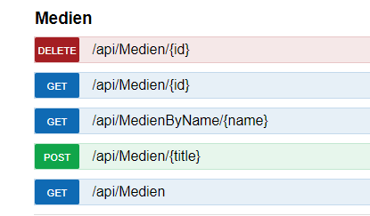

# Übung 7 - Webservice erstellen

Erstellen Sie einen REST Webservice der Daten zu Medien liefert.

Als Datenbasis kann eine einfache Liste benutzt werden welche die Titel von Medien beinhaltet. So können wir uns eine komplexe Datenstruktur (Datenbank sparen).

```csharp
private static List<string> testData = new List<string> (new String[] {"Herr der Ringe", "Titanic", "Venum", "Little Foot"});
```

## Zu implementierende Methoden



## Beispiel

Die zweite Methode liefert das Element mit einer gewünschten ID z.B. 2

`http://localhost:61403/api/Medien/2`

D.h. als Ergebnis würde "Venum" geliefert werden.

## Testen

Zum Testen der Funktion Swashbuckle (Swagger) benutzen. Port durch den ersetzen welchen ihr benutzt.

`http://localhost:61403/swagger/ui/`
