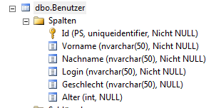

# Übung 8 - SQL

Erstellen Sie ein Konsolenprogramm wo Sie Benutzer zu einer Datenbank hinzufügen und abrufen können.
Beim Abrufen soll das Geschlecht abgefragt werden und nur entsprechende Daten angezeigt werden.

## Daten

Folgende Daten sollen eingegeben und abgefragt werden:

* Id (int, wird automatisch befüllt)
* Nachname
* Vorname
* Geschlecht
* Login
* Alter (int)



## Connection String

`Data Source=PC-DOZ-602\SQLEXPRESS; Initial Catalog=SoftwareDeveloper; User Id=softwaredeveloper; Password = 123test;`

## SQL Queries

### Daten nach Geschlecht gefiltert abrufen

```csharp
$"SELECT Nachname, Vorname, Geschlecht, Login, [Alter] FROM Benutzer WHERE Geschlecht= '{geschlecht}'"
```

### Daten schreiben

```csharp
$"INSERT INTO Benutzer(Nachname, Vorname, Geschlecht, Login, [Alter]) VALUES('{benutzer.Nachname}', '{benutzer.Vorname}', '{benutzer.Geschlecht.ToString()}', '{benutzer.Login}', {benutzer.Alter})";
```
