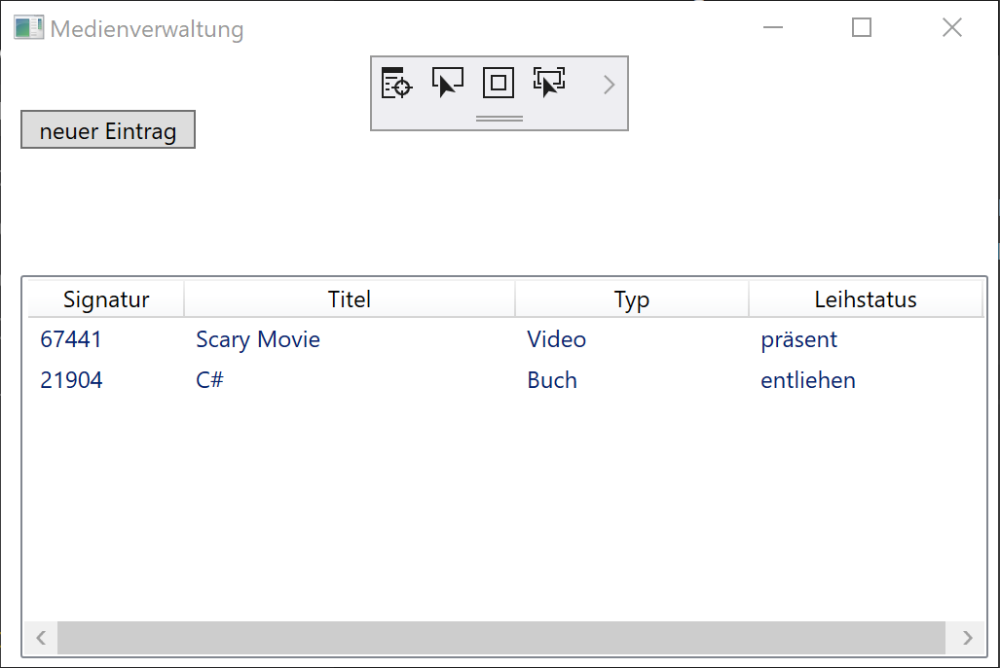
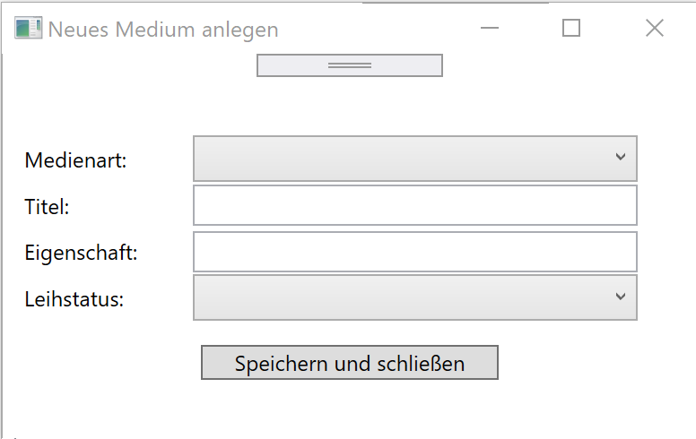
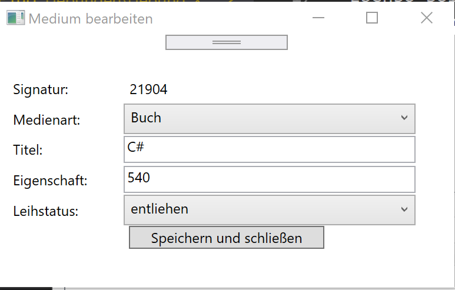

# Übung - Medienverwaltung GUI

Nehmen Sie unser Medienverwaltungsprojekt als Grundlage und erstellen Sie dafür eine Oberfläche.

## MainWindow

Im MainWindow sollen alle vorhandene Medien angezeigt werden. Dazu können Sie ein ListView Control verwenden.

### Beispiel



## Neues Element und bearbeiten

In einem neuen Fenster können alle Eigenschaften zu einem Medium eingegeben werden.

Ebenso soll das selbe Fenster zum bearbeiten genutzt werden wenn auf ein Element in der ListView geklickt wird.

### Beispiel





## Hinweise

* Verwenden Sie die bestehenden Klassen der Medienverwaltung weiter. Daran sind nur wenige Änderungen notwendig!

* Wenn Sie Data Binding benutzen wird das Füllen der Felder einfacher

* Ein neues/weiteres Fenster kann wie eine Klasse hinzugefügt und verwendet werden

```csharp
Item newItemWindow = new Item();
newItemWindow.ShowDialog();
```

* Die List View könnte so aufgebaut werden

```xml
 <ListView x:Name="lstView" SelectionChanged="lstView_PreviewMouseLeftButtonDown">
            <ListView.View >
                <GridView>
                    <GridViewColumn Header="Signatur" Width="80" DisplayMemberBinding="{Binding Path=Signatur}" />
                    <GridViewColumn Header="Titel" Width="170" DisplayMemberBinding="{Binding Path=Titel}"/>
                    <GridViewColumn Header="Typ" Width="120" DisplayMemberBinding="{Binding Path=Typ}"/>
                    <GridViewColumn Header="Leihstatus" Width="120" DisplayMemberBinding="{Binding Path=LeihstatusMedien}"/>
                </GridView>
            </ListView.View>
        </ListView>
```