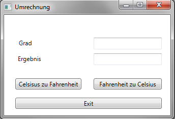
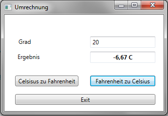

# Übung - Umrechnung

Erstellen Sie eine WPF Anwendung zum Umrechnen von Celsius in Fahrenheit und umgekehrt.

Vergeben Sie für die verwendeten Elemente sprechende Namen, wie z.B. "btnExit" für den Exit-Button. 

Die Höhe der Grad soll in einem Textfeld eingegeben werden können. Stellen Sie dem Textfeld ein Label voran, so dass klar hervorgeht um was es sich handelt.

Die Berechnung soll in einem `readonly` Textfeld zentriert dargestellt werden. Der Text des Ergebnisses soll dabei die Eigenschaft fett haben.

Verwenden Sie zur Berechnung zwei Buttons (achten Sie auf passende Namen). Die Texte sind **Celsius zu Fahrenheit** und **Fahrenheit zu Celsius**. Hinterlegen Sie für die Buttons "Click"-Events, indenen die Berechnungen durchgeführt werden.

Überprüfen Sie, ob in dem Eingabefeld etwas eingegeben wurde und ob die Eingabe korrekt war. Runden Sie, wenn nötig, die Ergebnisse auf zwei Nachkommastellen (`Math.Round()`).

## Umrechnungsformeln

```csharp
TempFtoC = ((temp – 32) * 5) / 9
TempCtoF = (temp * 9 / 5) + 32
```

## Beispiel



