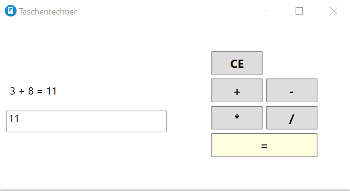

# Übung - Taschenrechner

Erstellen Sie einen Taschenrechner der die Grundrechenarten beherrscht.

Sie können die GUI frei nach Ihren Wünschen gestalten. Um das Programm einfacher zu halten können Sie drei Textfelder anstatt einem Textfeld (wie im Beispiel) nutzen.

## Hinweise

* Benutzen Sie als Layout kein `Canvas`.
* Fehlerhafte und ungültige Eingaben sollen abgefangen und eine Meldung ausgegeben werden.
* Achten Sie außerdem darauf, dass ein Teilen durch 0 nicht möglich ist.
* Setzen Sie ein Icon für die Anwendung, z.B. das "calculator.ico".

## Beispiel

