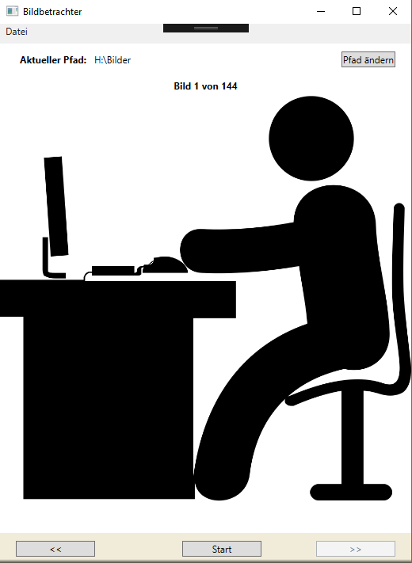

# Übung - Bildbetrachter

Erstellen Sie eine WPF Anwendung um alle Bilder aus einem ausgewählten Pfad anzuzeigen. Durch "vor" und "zurück" kann das nächste/vorherige Bild angezeigt werden.

Achten Sie darauf, dass Sie folgende Funktionalitäten einbinden:

* Der Ordner soll über einen Auswahldialog gewählt werden können.
* Es sollen nur Bilder mit der Endung *.jpg angezeigt werden.
* Der Ordner soll in der laufenden Anwendung geändert werden können.
* Der Ordner und das aktuell angezeigte Bild sollen angezeigt werden.
* Achten Sie auf Arrayüberlaufe oder nutzen Sie ein anderes Konstrukt.
* Integrieren Sie ein Menü mit dem Menüpunkt "Datei" welcher einen Untereintrag "beenden" besitzt.

## Ordnerauswahldialog

Einen Ordnerauswahldialog erhalten Sie mit folgendem Code:

```csharp
var folderDialog = new OpenFolderDialog
{
    // Optionen definieren
};

if (folderDialog.ShowDialog() == true)
{
    var folderName = folderDialog.FolderName;
}
```

## Dateien eines Ordners abfragen

```csharp
var dateien = Directory.GetFiles(folderPath, "*.jpg", SearchOption.TopDirectoryOnly);
```

## Image Control Bild setzen

```csharp
img.Source = new BitmapImage(new Uri("c:\\Pfad\\zum\\Bild.jpg"))
```

## Button Beschriftung

Um die >> und << als Beschriftung für die Buttons zu nutzen kann folgende Zeichenfolge verwendet werden:

\&lt;\&lt; und \&gt;\&gt;

## Optional

Bauen Sie eine Diashow-Funktion ein, die Sie starten und beenden können. Dazu kann die Klasse `DispatcherTimer` benutzt werden.

## Beispiel


