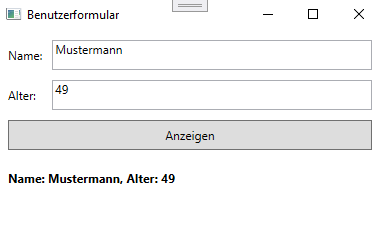

# Übung - Formular

Erstellen Sie ein Formular mit Textfeldern und einem Button, um Benutzerdaten einzugeben (Name und Alter).

* Binden Sie die Eingabefelder an eine Klasse `User` mit Properties für `Name` und `Age`.
* Zeigen Sie die eingegebenen Daten in einem Label an, sobald der Button "Anzeigen" geklickt wird.
* Greifen Sie hierzu nicht direkt auf die UI-Elemente zu, sondern nutzen Sie nur Data Binding!

## Beispiel

