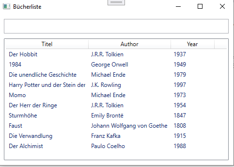
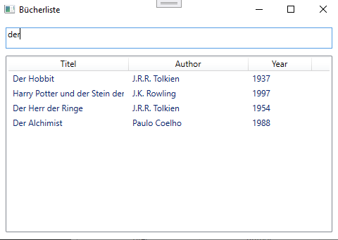

# Übung - Bücherfilter

## Teil 1

Erstellen Sie eine WPF-Anwendung mit einer `ListView`, die eine Liste von Büchern (Titel, Autor, Erscheinungsjahr) anzeigt.

Auch hier soll wieder DataBinding genutzt werden und nicht direkt auf die Steuerelemente zugegriffen werden.

### Book-Klasse

```csharp
public class Book
{
    public string Title { get; set; }
    public string Author { get; set; }
    public int Year { get; set; }
}
```

### Beispieldaten

```csharp
new Book { Title = "Der Hobbit", Author = "J.R.R. Tolkien", Year = 1937 },
new Book { Title = "1984", Author = "George Orwell", Year = 1949 },
new Book { Title = "Die unendliche Geschichte", Author = "Michael Ende", Year = 1979 },
new Book { Title = "Harry Potter und der Stein der Weisen", Author = "J.K. Rowling", Year = 1997 },
new Book { Title = "Momo", Author = "Michael Ende", Year = 1973 },
new Book { Title = "Der Herr der Ringe", Author = "J.R.R. Tolkien", Year = 1954 },
new Book { Title = "Sturmhöhe", Author = "Emily Brontë", Year = 1847 },
new Book { Title = "Faust", Author = "Johann Wolfgang von Goethe", Year = 1808 },
new Book { Title = "Die Verwandlung", Author = "Franz Kafka", Year = 1915 },
new Book { Title = "Der Alchimist", Author = "Paulo Coelho", Year = 1988 },
```

### Beispiel




## Teil 2

Fügen Sie nun überhalb der `ListView` ein Textfeld ein, mit dem die Liste der Bücher nach Titel, Autor oder Jahr gefiltert werden kann.

### Beispiel mit Filterung

