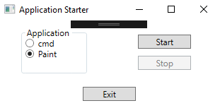

# Übung - App Starter

Erstellen Sie eine WPF Anwendung die Programme öffnet bzw. Prozesse startet. 

Zusätzlich soll die Möglichkeit bestehen die selbst gestarteten Prozesse wieder beenden zu können.

* Konsole mit dem Startpfad c:\Users öffnen.
* MS Paint mit einem Bild als Startparameter öffnen.

## Beispiel

