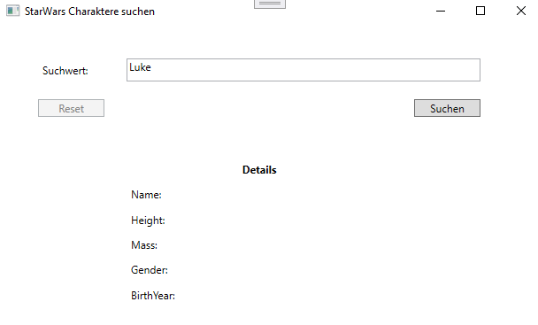
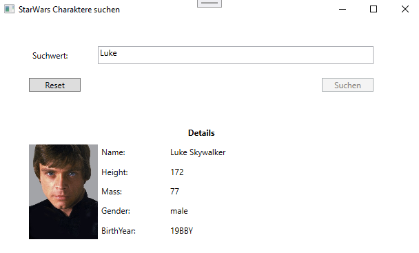

# Webservice abrufen

## Teil 1

Erstellen Sie eine WPF Anwendung welche Daten zu Star Wars Charaktere anzeigt. Als Parameter wird ein Suchwort benötigt womit nach dem Name eines Charakter gesucht werden kann. Es soll nur das erste Ergebnis angezeigt werden.

[Star Wars API Beschreibung](https://swapi.dev/)

Endpunkt für die Suche: https://swapi.dev/api/people?search=Suchbegriff

### Daten

Es sollen folgende Daten angezeigt werden:

* Name
* Größe
* Gewicht
* Geschlecht
* Geburtsdatum

### Hinweis

Der Webservice liefert einen JSON-String zurück. Dieser muss deserialisiert werden.
Dazu ist ein Objekt nötig welches die Daten aufnehmen kann. [Json2CSharp](https://json2csharp.com/) kann dazu sehr nützlich sein.

## Teil 2

Zusätzlich soll ein Bild zum Charakter angezeigt werden.

Das Bild kann von https://vieraboschkova.github.io/swapi-gallery/static/assets/img/people/1.jpg abgefragt werden. Wobei die "1" für die ID des Charakter steht. Die ID kann aus der URL extrahiert werden.

## Beispiel

