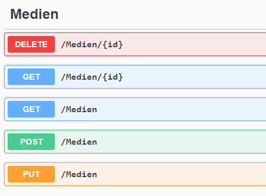

# Übung - Webservice erstellen

Erstellen Sie einen Webservice der Daten zu Medien liefert.

Als Datenbasis kann ein Dictionary genutzt werden:

```csharp
public static Dictionary<int, Medium> MedienDic = new Dictionary<int, Medium>
{
    { 1111, new Medium{ Titel= "Herr der Ringe", Signatur = 1111, Status = Leihstatus.präsent } },
    { 2222, new Medium{ Titel= "Venum", Signatur = 2222, Status = Leihstatus.präsent } },
    { 3333, new Medium{ Titel= "Titanic", Signatur = 3333, Status = Leihstatus.präsent } },
};
```

Medien.cs:
```csharp
public class Medium
{
    public int Signatur { get; set; }
    public Leihstatus Status { get; set; }
    public string Titel { get; set; }
}
```

## Zu implementierende Methoden



### Folgendes soll geprüft werden

* Prüfen ob die zu löschende ID vorhanden ist.
* Prüfen ob es ein Element mit der ID gibt.
* Prüfen ob bereits ein Eintrag mit dieser ID existiert.
* Prüfen ob ein Update möglich ist, ob die ID überhaupt existiert.

### Beispiel

Die zweite Methode liefert das Element mit der gewünschten ID z.B. 2222

`http://localhost:61403/Medien/2222`

Liefert als Ergebnis:

```json
{
  "signatur": 2222,
  "status": 0,
  "titel": "Venum"
}
```

## Testen

Zum Testen der Funktion Swashbuckle (Swagger) benutzen. Port durch den ersetzen welchen ihr benutzt.

`http://localhost:61403/swagger/ui/`
